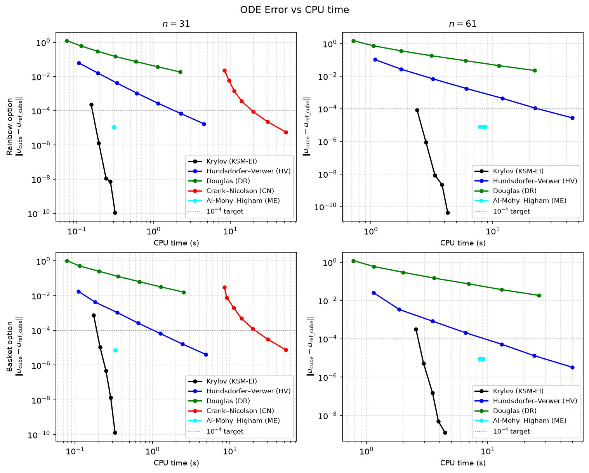

# caksm - Communication-Avoiding Krylov Subspace Methods for Option Pricing

PDE-based pricer for two 3-asset European options (basket call and rainbow min-call), written in C++23. 
Five numerical methods are implemented: Crank-Nicolson, two ADI variants, Matrix Exponential, and a Krylov subspace exponential integrator.

## Benchmark plots

The script `scripts/benchmark_plots.py` reproduces Figure 1 from Niesen and Wright: log-log plots of ODE error vs CPU time for all five methods, across both option types and both grid sizes.

It requires sweep data for both `n=31` and `n=61` to have been collected first:

```bash
bash scripts/sweep_n31.sh
batch scripts/sweep_n61.sh
```

Once the data is in place, run the script with [`uv`](https://docs.astral.sh/uv/getting-started/installation/), which creates an isolated environment automatically:

```bash
uv run scripts/benchmark_plots.py
```

The plot is saved to `scripts/benchmark_plots.png`.



## Dependencies

| Library  | Source                           | Purpose                                         |
|----------|----------------------------------|-------------------------------------------------|
| `Eigen`  | fetched via CMake `FetchContent` | Sparse linear algebra, dense matrix exponential |
| `Catch2` | fetched via CMake `FetchContent` | Unit testing framework                          |

No system-level installs are required. CMake downloads Eigen and Catch2 automatically on first configure.

## Build

```bash
cmake -B build -DCMAKE_BUILD_TYPE=Release
cmake --build build --parallel
```

The binary is `build/pricer`. An optional compile-commands symlink improves IDE integration:

```bash
ln -sf build/compile_commands.json compile_commands.json
```

### Run tests

```bash
cd build && ctest --output-on-failure
```

## Usage

```
./build/pricer [OPTIONS]
```

| Option                     | Default             | Description                                                                                                |
|----------------------------|---------------------|------------------------------------------------------------------------------------------------------------|
| `--benchmark`              | *(required to run)* | Run all five methods for both option types                                                                 |
| `--option basket\|rainbow` | `basket`            | Select which option type to price                                                                          |
| `--n N`                    | `15`                | Grid points per spatial dimension                                                                          |
| `--steps M`                | `100`               | Temporal steps for CN, ADI-DR, ADI-HV, and KSM-EI (ME selects steps automatically)                         |
| `--tol T`                  | `1e-8`              | KSM-EI convergence tolerance; when given, KSM-EI uses the default step count (100) regardless of `--steps` |
| `--export`                 |                     | Write per-run results to a timestamped CSV in the working directory                                        |
| `--save-referee`           |                     | Compute the ME referee for both option types, write binary cache files to `--referee-dir`, then exit       |
| `--referee-dir DIR`        |                     | In `--benchmark` mode: load pre-computed referee files from `DIR` instead of recomputing them              |
| `--help`                   |                     | Print usage summary and exit                                                                               |

### Flag interaction: `--steps` and `--tol`

`--steps` controls the number of temporal substeps for the time-stepping methods. `--tol` controls
the per-step Krylov convergence criterion for KSM-EI. When both flags are provided, KSM-EI
uses the given tolerance and reverts to the default step count (100), while CN and the ADI methods
continue to use `--steps`. This lets you sweep KSM-EI tolerance independently without changing
the step count used to benchmark the other methods.

| Flags given          | CN / ADI-DR / ADI-HV | KSM-EI steps | KSM-EI tol |
|----------------------|----------------------|--------------|------------|
| *(neither)*          | 100                  | 100          | 1e-8       |
| `--steps M`          | M                    | M            | 1e-8       |
| `--tol T`            | 100                  | 100          | T          |
| `--steps M --tol T`  | M                    | 100          | T          |

### Referee caching

The ME referee is the dominant cost for large grids ($n=61$ basket requires $\approx 4.5 \times 10^6$ substeps at $m=55$).
When running a parameter sweep, compute it once and reuse it for every subsequent benchmark call:

```bash
# Step 1 — compute and save (runs once, exits after saving)
./build/pricer --n 31 --save-referee --referee-dir data/n31

# Step 2 — all benchmark runs load from the cache (no recomputation)
./build/pricer --benchmark --n 31 --steps 128 --referee-dir data/n31
./build/pricer --benchmark --n 31 --tol 1e-5  --referee-dir data/n31
```

Cache files are named `referee_n{N}_basket.bin` and `referee_n{N}_rainbow.bin`.
If `--referee-dir` is given but a file is missing, the referee is computed inline with a warning.
The sweep scripts (`scripts/sweep_n31.sh`, `scripts/sweep_n61.sh`) do this automatically.

### Examples

```bash
# Default benchmark: both option types, n=15, 100 steps
./build/pricer --benchmark

# Rainbow only, finer grid
./build/pricer --benchmark --option rainbow --n 20 --steps 200

# Basket only, coarse grid for quick sanity check
./build/pricer --benchmark --option basket --n 10 --steps 50

# Sweep KSM-EI tolerance (steps fixed at default 100 for all methods)
./build/pricer --benchmark --option basket --n 15 --tol 1e-4
./build/pricer --benchmark --option basket --n 15 --tol 1e-6
./build/pricer --benchmark --option basket --n 15 --tol 1e-10

# Sweep step count for time-steppers while holding KSM-EI at a fixed tolerance
./build/pricer --benchmark --option basket --n 15 --steps 50  --tol 1e-8
./build/pricer --benchmark --option basket --n 15 --steps 100 --tol 1e-8
./build/pricer --benchmark --option basket --n 15 --steps 200 --tol 1e-8

# Full parameter sweep with referee caching and CSV export
mkdir -p data/n31
./build/pricer --n 31 --save-referee --referee-dir data/n31
for steps in 16 32 64 128 256 512 1024; do
    ./build/pricer --benchmark --n 31 --steps $steps --referee-dir data/n31 --export
done
```

### Sample output

Without referee cache (`--benchmark --n 12 --steps 50`):

```
European Option PDE Pricer [Benchmark]

 Basket call
  Parameters: n=12, steps=50, K=100, r=0.04, T=1.0
  sigma=[0.30,0.35,0.40]  rho_off=[0.5,0.5,0.5]
  KSM-EI: tol=1.00e-08, steps=50
  Reference price: 13.2449

  [Building PDE system...]
  [Computing ME referee...]
  [ME referee: m=55, s=7082]
  Method            Price     PDE Err     ODE Err    Time(ms)
  ------------------------------------------------------------
  CN               8.4401      4.8048   3.550e-03        22.4
  ADI-DR           8.4530      4.7919   1.934e-01         6.2
  ADI-HV           8.4400      4.8049   2.091e-03        10.0
  ME               8.4400      4.8049   2.142e-06         8.6
  KSM-EI           8.4400      4.8049   5.208e-11         8.4


 Rainbow min-call
  ...
```

With referee cache (`--save-referee` run first, then `--benchmark --referee-dir data/n12`):

```
European Option PDE Pricer [Benchmark]
  Referee loaded: data/n12/referee_n12_basket.bin
  Referee loaded: data/n12/referee_n12_rainbow.bin

 Basket call
  ...
  [Building PDE system...]
  [ME referee: loaded from file]
  Method            Price     PDE Err     ODE Err    Time(ms)
  ------------------------------------------------------------
  CN               8.4401      4.8048   3.550e-03        22.4
  ...
```

The large PDE errors are due to the coarse grid (n=12); increase `--n` for higher accuracy.

### Error columns

| Column    | Formula                                          | Definition                                       |
|-----------|--------------------------------------------------|--------------------------------------------------|
| `PDE Err` | $\|\text{price} − \text{analytical_reference}\|$ | Spatial / Temporal discretization error          |
| `ODE Err` | $\|\text{u_cube} − \text{u_ref_cube}\|$          | ODE integration error relative to the ME referee |

**ME referee:** before each option type is benchmarked, a high-accuracy matrix-exponential solution is computed
with fixed parameters $m=55$ (maximum Taylor degree) and $\theta=9.9$, giving $s = \lceil \dfrac{T \|\tilde{A}\|_1}{\theta} \rceil$
internal substeps and tolerance $2^{-53} \approx 1.1 \times 10^{-16}$. The ODE error measures how well each solver
tracks this reference on the $9 \times 9 \times 9$ grid neighborhood centered on the spot, independently of spatial discretization.
For large grids this computation is expensive; use `--save-referee` to cache it once and `--referee-dir` to reuse it across runs.

## Default model parameters

| Parameter                | Value              | Description                                                 |
|--------------------------|--------------------|-------------------------------------------------------------|
| Spot prices $S_0$        | (100, 100, 100)    | Initial asset prices                                        |
| Strike K                 | 100                | Option strike                                               |
| Risk-free rate r         | 0.04               | Continuously compounded                                     |
| Maturity T               | 1.0 year           | Fixed                                                       |
| Volatilities $\sigma$    | (0.30, 0.35, 0.40) | Per-asset annual vol                                        |
| Correlations $\rho$      | (0.50, 0.50, 0.50) | Off-diagonal pairs ($\rho_{01}, \rho_{02}, \rho_{12}$)      |
| Basket weights w         | (1/3, 1/3, 1/3)    | Equal-weight basket                                         |
| Grid half-width $\alpha$ | 2.85               | Log-price domain $\pm \alpha \sigma \sqrt{T}$ per dimension |


## Numerical methods

| Method   | Scheme                                                | Temporal steps                        | Notes                                                           |
|----------|-------------------------------------------------------|---------------------------------------|-----------------------------------------------------------------|
| `CN`     | Crank-Nicolson ($\theta = 0.5$)                       | `--steps`                             | Fully implicit 2nd-order, SparseLU per run                      |
| `ADI-DR` | Douglas-Rachford ADI ($\theta = 0.5$)                 | `--steps`                             | 3 direction-split solves per step                               |
| `ADI-HV` | Hundsdorfer-Verwer ADI ($\theta = 0.5, \sigma = 0.5$) | `--steps`                             | DR predictor + HV corrector                                     |
| `ME`     | Matrix Exponential (scaling-and-squaring)             | automatic                             | Taylor polynomial, $\infty$-norm early exit                     |
| `KSM-EI` | Krylov subspace exponential integrator                | `--steps` or 100 (when `--tol` given) | Incremental Arnoldi, expm on small $H_m$; tolerance via `--tol` |

## Model

3-asset Black-Scholes PDE in log-price coordinates, solved backward in pseudo-time $\tau$ from 0 (payoff) to T (price):

$$
\frac{\partial u}{\partial \tau} = \frac{1}{2} \sum_{d,d'} \rho_{dd'} \sigma_d \sigma_{d'} \frac{\partial^2 u}{\partial x_d \partial x_{d'}} + \left(r - \tfrac{1}{2}\sigma_d^2\right) \frac{\partial u}{\partial x_d} - r \, u + b(\tau)
$$

**Basket call payoff:**

$$
u_0(x) = \max\!\left(\sum_d w_d e^{x_d} - K,\ 0\right)
$$

**Rainbow min-call payoff:**

$$
u_0(x) = \max\!\left(\min_d e^{x_d} - K,\ 0\right)
$$

The boundary forcing term $b(\tau)$ for the basket case is encoded as a polynomial $B \cdot s(\tau)$ with $s(\tau) = [\tau^2/2,\, \tau,\, 1]^\top$, derived from a deep-ITM approximation on ghost nodes outside the grid. 
The rainbow case uses modified finite-difference stencils (zero-gamma boundary condition) instead.
