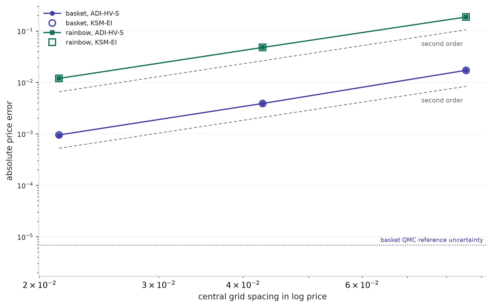
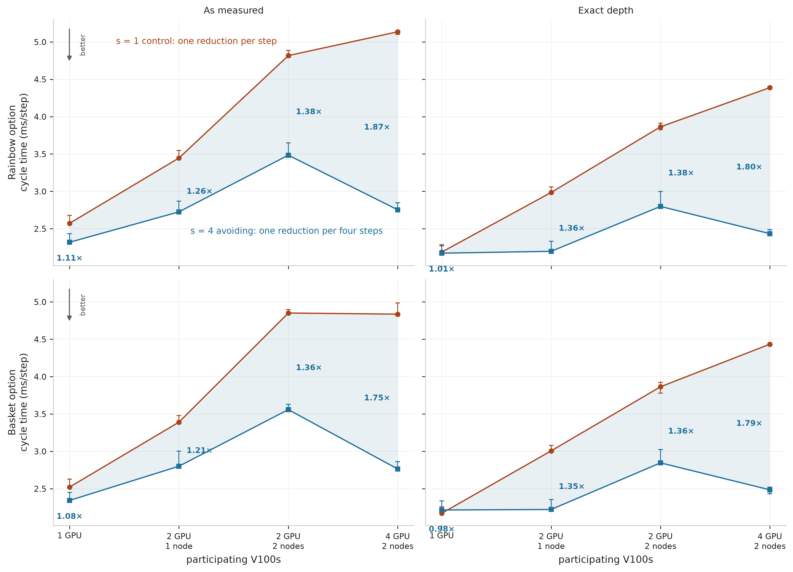

# Communication-Avoiding Krylov Exponential Integration for Multi-GPU Option Pricing

This repository studies when communication avoidance helps a Krylov exponential integrator for
three-asset option-pricing PDEs. The central idea is simple: extra arithmetic can be worthwhile
when it replaces expensive data movement or synchronization. The difficult part is identifying
where that trade is favorable without assuming that a reduction in communication automatically
becomes a speedup.

The project combines three pieces:

- a C++23 benchmark pricer for Basket and Rainbow options;
- a regime analysis that separates cache-reuse and synchronization opportunities; and
- a matrix-free CUDA integrator that runs on one to four V100 GPUs across two nodes.

The [thesis source](docs/thesis/main.tex) and [compiled thesis](docs/thesis/main.pdf) are the
authoritative account. This README gives a shorter path through the implementation, the accepted
results, and the commands used to reproduce them.

## Poster

> Poster submitted for the [IMS 2026](https://www.maths.tcd.ie/IMS2026/) Poster competition.


## Main results

- The financial references are a randomized QMC Basket price of `13.2448993` with a 95% half-width
  of `6.84e-6`, and a Johnson Rainbow price of `4.4450184168`, stable below `1e-13`. The QMC run uses
  16 independent scrambles, `2^21` points per scramble, and seed `25378095`.
- Both the Krylov and start-up-smoothed Hundsdorfer-Verwer solvers show second-order spatial
  refinement. At equal declared accuracy on one CPU thread, the Krylov solver is `5.80x` faster for
  the Basket and `6.39x` faster for the Rainbow.
- On the CPU, cutting the reduction count by `11–16x` gives no wall-clock improvement because
  reductions are not the limiting cost. Cache-blocked matrix powers also falls short of its modeled
  traffic opportunity because halo arithmetic and access latency remain important.
- Direct measurement places the real operator in the horizontal-only opportunity region at `n=25`,
  in neither region at `n=30–61`, and in the vertical-only region from `n=74`.
- On one V100, the promoted plane-streamed matrix-powers dispatch improves the complete solver by a
  `1.248x` geometric mean on four selection cases, with a `1.204x` worst case. Active held-out cases
  give a `1.239x` mean and `1.182x` worst case; small-grid fallbacks remain near parity at `0.991x`.
- In the distributed solver, the equal-work `s=4` arm is at parity with `s=1` on one V100 and is
  `1.78–1.80x` faster on four V100s. This is an algorithm-relative result. Four-GPU strong scaling
  at the same width is only `0.89x`, or about 22% efficiency, and the best four-GPU time is `12–15%`
  slower than the best one-GPU time.
- The largest-common-grid run at `n=337` passes the Krylov residual test but fails the independent
  boundary-state gate with an error of `6.40e-5`. A separate exact power-of-two augmentation-scaling
  diagnostic reduces that error to `4.41e-13`, identifying a concrete remediation. The original
  predeclared stop remains the reported result, and no validated price is claimed at that grid.

The regime coordinates are best read as opportunity indicators. Their unit lines organize the
experiments; they are not universal performance crossovers.

## Contents

- [Poster](#poster)
- [Platforms](#platforms)
- [Build and test](#build-and-test)
- [Pricing model and methods](#pricing-model-and-methods)
- [Financial validation](#financial-validation)
- [CPU baseline and scaling](#cpu-baseline-and-scaling)
- [Regime analysis](#regime-analysis)
- [Recomputing the map for GPUs](#recomputing-the-map-for-gpus)
- [Distributed CUDA integrator](#distributed-cuda-integrator)
- [Reproducing the studies](#reproducing-the-studies)
- [Repository layout](#repository-layout)

## Platforms

The CPU experiments and financial validation were run on **puffin**, a bare-metal workstation
with an AMD Ryzen Threadripper 3960X and an NVIDIA RTX 3090. The controlled V100 and distributed
experiments were run on **synge**, a two-node cluster with two Tesla V100-PCIE-16GB GPUs per node.
The two V100s within a node are attached to different NUMA sockets and communicate over PCIe and
UPI; the nodes communicate over InfiniBand.

| System | Relevant hardware | Role in the study |
|---|---|---|
| puffin | 24 CPU cores, 128 MiB L3 across eight CCX domains, RTX 3090 | CPU scaling, financial validation, and consumer-GPU controls |
| synge | 2 nodes, 2 V100s per node, 40 CPU cores and 2 NUMA domains per node | V100 profiling, kernel selection, and multi-GPU measurements |

The GPU comparison is useful because the RTX 3090 and V100 have the same nominal 6 MB L2 and
similar measured memory bandwidth, while their FP64 peaks differ substantially. They also differ
in several other architectural details, so the study does not attribute every difference to FP64
throughput alone.

Timed runs are accepted only when the requested hardware is reserved and the device-contention
gate reports an idle GPU. Correctness checks may still run on a busy device, but those timings are
not treated as acceptance measurements.

## Build and test

The CPU code requires a C++23 compiler, CMake, Eigen, Boost, and OpenMP. CUDA targets additionally
require the CUDA toolkit and NVML. Multi-GPU targets require NCCL and MPI.

```bash
cmake -S . -B build -DCMAKE_BUILD_TYPE=Release
cmake --build build --parallel
ctest --test-dir build --output-on-failure
```

On Synge, require MPI explicitly so configuration cannot silently omit the distributed targets:

```bash
cmake -S . -B build -DCMAKE_BUILD_TYPE=Release -DCAKSM_REQUIRE_MPI=ON
cmake --build build --parallel
```

The projected exponential stores four `m x m` binary64 work arrays and two integers in statically
allocated shared memory. Both tested GPU architectures permit 48 KiB for this unchanged kernel,
which gives the common production cap `m_max=39`: `m=39` uses 48,680 bytes, whereas `m=40` would
need 51,208 bytes. Other builds can choose a lower value with
`CAKSM_GPU_CA_MAX_M`; configuration rejects values above the kernel's static limit.

## Pricing model and methods

The model is a three-asset Black–Scholes PDE for two European payoffs:

- **Basket:** a call on the arithmetic mean of the assets;
- **Rainbow:** a call on the minimum of the assets.

The discretization uses a three-dimensional log-price grid and a 19-point stencil. The benchmark
contains Crank–Nicolson, two ADI variants, a one-shot matrix exponential, and a Krylov exponential
integrator. The production GPU path applies the stencil matrix-free and uses a monomial
matrix-powers basis with CholeskyQR2.

The historical Niesen–Wright experiment remains a useful semi-discrete time-integration control:

```bash
./build/pricer --benchmark
uv run scripts/plots/benchmark_plots.py
```

Its approximately 700-second historical Hundsdorfer–Verwer result at `61^3` provides context, not
a contemporary hardware baseline. All method speedups reported in this repository come from
matched measurements on the same machine and problem.

## Financial validation

The PDE solvers are checked against references that share model parameters but no PDE assembly,
boundary, interpolation, ADI, or Krylov implementation. This separation is important: agreement
with the same semi-discrete operator can validate time integration, but it cannot validate the
financial price by itself.

### Independent references

| Payoff | Primary reference | Value | Uncertainty or stability | Cross-check |
|---|---|---:|---:|---|
| Basket | randomized QMC | 13.2448993 | 95% half-width `6.84e-6` | successive Sobol levels |
| Rainbow | Johnson formula | 4.4450184168 | stable below `1e-13` | QMC `4.4450147 ± 7.49e-6` |

The randomized QMC reference uses 16 independent scrambles and accepts `2^21 = 2,097,152` points
per scramble. Its deterministic seed is the student ID `25378095`; the seed fits safely within the
implementation's integer types and the reproducibility gate passes.

```bash
./build/financial-reference
./build/financial-reference --gates-only
./build/financial-reference --summary
```

### Error hierarchy

The validation widens the domain, refines the spatial grid, and then refines time. This order keeps
one error source from being mistaken for another. The accepted domain scale is `alpha=4.275`.

| Error component | Basket | Rainbow |
|---|---:|---:|
| independent reference | `6.8e-6` | `<1e-13` |
| domain truncation | `1.0e-4` | `4.5e-6` |
| spatial discretization | `2.9e-3` | `3.6e-2` |
| ADI temporal | `2.2e-6` | `2.4e-5` |
| Krylov temporal | `5.3e-15` | `3.6e-15` |

Spatial discretization is the largest unresolved component for both payoffs. Improving the price
therefore requires grid refinement rather than tighter Krylov tolerances.

Both methods show second-order spatial refinement. At `n=121`, Basket Delta errors are
`0.011–0.020%`, while Rainbow Delta errors are `0.17–0.24%`. Diagonal Gamma needs a more careful
reading. Trilinear interpolation is linear within a cell, so it cannot recover reliable sub-cell
curvature. The grid-node stencil avoids that extraction limitation: its Basket Gamma centers differ
from QMC by `0.011–0.066%`, within the reference's `0.05–0.22%` uncertainty; the Rainbow differences
are `0.54–0.88%`, against `0.13–0.30%` uncertainty. No off-node Gamma accuracy claim is made.

### Equal-accuracy CPU comparison

The timing rule rejects configurations that meet the total target only through cancellation between
spatial and temporal errors. The next finer temporal setting must also pass.

At `n=61`, `alpha=4.275`, and one CPU thread:

| Payoff | Method | Steps | Price | Absolute error | Median | Range |
|---|---|---:|---:|---:|---:|---:|
| Basket | ADI-HV-S | 50 | 13.241066 | `3.83e-3` | 3.090 s | 3.076–3.095 s |
| Basket | KSM-EI | 1 | 13.240901 | `4.00e-3` | 0.533 s | 0.532–0.536 s |
| Rainbow | ADI-HV-S | 50 | 4.397854 | `4.72e-2` | 2.936 s | 2.914–2.944 s |
| Rainbow | KSM-EI | 1 | 4.397355 | `4.77e-2` | 0.460 s | 0.458–0.462 s |

The declared targets are `4.08e-3` for the Basket and `5.01e-2` for the Rainbow. The autonomous
Krylov problem can be advanced with one exponential action to the stopping tolerance; the smoothed
ADI solver needs 50 time steps under the same rule. The resulting Krylov speedups are `5.80x` and
`6.39x`, with non-overlapping timing ranges.

```bash
./build/financial-validation
uv run scripts/plots/financial_validation.py
```



## CPU baseline and scaling

The OpenMP study first measures the existing solver before introducing communication avoidance. At
`n=61`, the sparse matrix-vector product reaches `36.7x` speedup on 24 cores, with its main scaling
knee at 12 cores. A contiguous row schedule sustains about 176 GB/s from the cache hierarchy; cyclic
and rotating schedules reach only about 36 and 66 GB/s.

Here `block`, `cyclic`, and `rotate` name **CPU row schedules**. They are unrelated to a Krylov block
or a CUDA thread block.

The locality controls support a specific conclusion: contiguity, rather than assigned row volume by
itself, keeps the active slice resident in cache. Gram–Schmidt scales poorly because repeated basis
reads are bandwidth-sensitive, not because the reduction primitive dominates.

```bash
./scripts/scaling/scaling_strong.sh
./scripts/scaling/scaling_weak.sh
./scripts/scaling/scaling_mn.sh
./scripts/scaling/scaling_locality.sh
uv run scripts/plots/scaling_plot.py
```


## Regime analysis

The regime map separates two opportunities:

| Coordinate | Ratio | Opportunity it describes |
|---|---|---|
| `R_v` | Arnoldi working set / aggregate last-level cache | vertical reuse through matrix powers |
| `R_h` | reduction cost / useful work between reductions | horizontal savings from fewer reductions |

The unit lines `R_v=1` and `R_h=1` divide the plane into four named regions: neither mechanism,
horizontal only, vertical only, and both. They are equality lines in the model, not promises of a
speedup. Machine-dependent cache, bandwidth, latency, and topology terms must be recalibrated on a
new system.

### Numerical guard and reduction ledger

The synthetic instrument checks its spectrum, similarity transform, Krylov behavior, and basis
conditioning before any timing result is interpreted. The implemented `u^-1/2` CholeskyQR2 guard
predicts the admitted power within one degree in all 21 sampled closed-spectrum cases, and exactly in
20. This is empirical evidence for the tested range. The available dimension-dependent sufficient
condition is much more restrictive and does not cover the largest measured production block, so the
thesis does not present the heuristic as a stability theorem.

For the real problem's `m=8–11` window, a certified monomial block reduces the Arnoldi reduction
count by `11–16x`. On puffin this reduction does not improve wall-clock time: replacing the primitive
with a `1.7x` faster tree reduction changes Gram–Schmidt time by less than 5%.

The non-normality experiment is also empirical. Error in the spectral conditioning estimate grows
with `log10(kappa(X))`; fitted sensitivities are `0.069` for the constant-coefficient family and
`0.250` for variable advection. The real Black–Scholes controls lie `0.19–0.85` decades from the
prediction at `kappa(X) <= 2.3e3` and are excluded from both fits.

### Vertical experiment and block-width limits

The CPU matrix-powers experiment does not reach its modeled traffic opportunity:

| Access pattern | Tile level | Measured speedup |
|---|---|---:|
| banded | L3 | `0.72–1.31x` |
| banded | L2 | `0.37–0.89x` |
| scattered fallback | L3 | `1.00x` |

The measurements point to redundant halo work and access latency. DRAM traffic is modeled rather
than counted on puffin because the required uncore counters were unavailable without elevated
access; the figures label modeled quantities accordingly.

The block-width sweep covers every recurrence degree from 1 to 39. In this instrument, `s` is the
highest power, so the block contains `s+1` columns. This differs from the distributed solver's
`--s`, which is the number of consumed block columns.

| Tile level | `n_1` | Guard limit `s` | Capacity limit `s` | First limit |
|---|---:|---:|---:|---|
| L3 | 420 | 8 | 23 | heuristic guard |
| L3 | 480 | 6 | 21 | heuristic guard |
| L3 | 560 | 6 | 19 | heuristic guard |
| L2 | 420 | 8 | 1 | capacity |
| L2 | 480 | 6 | 1 | capacity |
| L2 | 560 | 6 | 1 | capacity |

### Measured placement of the pricing operator

The production placement constructs the real sparse operator and measures its Krylov dimension at
`h=0.01` and tolerance `1e-8`.

| `n` | `N` | measured `m` | `R_v` | `R_h` | Opportunity |
|---:|---:|---:|---:|---:|---|
| 25 | 15,625 | 9 | 0.0356 | 1.017 | horizontal only |
| 30 | 27,000 | 10 | 0.0636 | 0.623 | neither |
| 40 | 64,000 | 12 | 0.160 | 0.292 | neither |
| 50 | 125,000 | 15 | 0.336 | 0.171 | neither |
| 61 | 226,981 | 18 | 0.653 | 0.1057 | neither |
| 74 | 405,224 | 22 | 1.266 | 0.0671 | vertical only |
| 90 | 729,000 | 27 | 2.499 | 0.00863 | vertical only |
| 120 | 1,728,000 | 41 | 7.377 | 0.00464 | vertical only |

The first sampled vertical-only point is `n=74`. This identifies matrix-powers reuse as worth
testing; it does not predict that the current tiled kernel will be faster.

```bash
./scripts/regime/calibrate_alpha.sh
./scripts/regime/regime_control_launch.sh
./scripts/regime/regime_control_launch.sh --status
./scripts/regime/regime_control.sh --merge
./scripts/regime/regime_dsweep_launch.sh
./scripts/regime/regime_dsweep.sh --merge
./scripts/regime/regime_sweep.sh
./scripts/regime/regime_swidth.sh
./scripts/regime/regime_placement.sh

uv run scripts/plots/regime_plot.py
uv run scripts/plots/regime_sweep_plot.py
uv run scripts/plots/regime_swidth_plot.py
```


## Recomputing the map for GPUs

Moving the map to a GPU changes cache ownership, reduction tiers, and memory coalescing. The
dimensionless definitions still apply, but every machine-dependent term is recomputed.

| GPU | L2 | Measured bandwidth | FP64 peak | FP64 ridge |
|---|---:|---:|---:|---:|
| RTX 3090 | 6 MB | 821 GB/s | 0.570 TFLOP/s | 0.69 FLOP/B |
| Tesla V100 | 6 MB | 818 GB/s | 6.375 TFLOP/s | 7.79 FLOP/B |

The calibrated V100 reduction ladder is 0.42 microseconds at warp scope, 0.79 at CUDA-thread-block
scope, 5.54 at grid scope, 11.46 across devices within a node, and 22.09 across nodes. The modeled
upper-right opportunity region begins between the CUDA-thread-block and grid levels, at a threshold
near 0.9 microseconds. This remains a placement result rather than a measured universal crossover.

At production resolution, the selected levels give `R_v=7.2` and `R_h=1.7`. A roofline check is
still required. SpMV and MGS are memory-bound on both cards, but the `s=8` tall-skinny Gram kernel
has arithmetic intensity near 1.1 FLOP/B: it is memory-bound on the V100 and compute-bound on the
RTX 3090. The communication interpretation therefore applies to the former and not the latter.

The specialized kernels make this comparison measurable:

| Kernel at `s=8` | V100 | RTX 3090 |
|---|---|---|
| split-K Gram | `2091x` over the tested cuBLAS shape; 88% DRAM | `1915x`; 79% FP64 |
| per-row triangular solve | `4.26x`; 95% DRAM | `27.39x`; 94% of the roof, near the knee |

These ratios are specific to the tested tall-skinny shapes and harness. They are not general
comparisons with every current vendor-library implementation.

At matched `m=12`, the block orthogonalizer replaces MGS's 91 reductions with 5 while maintaining
observed orthogonality near `1e-15`. Across two GPUs, the measured all-reduce latency is about
11.5 microseconds and the five-reduction arm is faster throughout the tested range. This is an
orthogonalizer experiment, not an end-to-end pricing result.

```bash
./scripts/regime/gpu_probe.sh
./scripts/regime/calibrate_gpu.sh
./scripts/regime/calibrate_gpu_p2p.sh
./scripts/regime/regime_gpu_place.sh
./scripts/regime/gram_splitk_test.sh
./scripts/regime/trsm_test.sh
./scripts/regime/regime_gpu_sstep.sh
./scripts/regime/regime_gpu_sstep_2gpu.sh
```

## Distributed CUDA integrator

The complete solver distributes contiguous slabs of the three-dimensional grid across up to four
V100s. A **slab** is a spatial ownership partition between GPUs. A **CUDA thread block** is a group
of GPU threads. A **Krylov block** is a group of basis columns. The qualifier is included whenever
`block` could otherwise be ambiguous.

Each Krylov block of width `s` contains columns through `A^(s-1)v`, so it requires exactly `s-1`
operator applications and a deep halo `s-1` planes wide. The final results use this exact-work rule.
Both `s=1` and `s=4` move one halo plane per basis vector; `s=4` reduces message count rather than
message volume.

### Strong and weak scaling

At `n=61`, 100 time steps, tolerance `1e-8`, and `m_max=39`:

| Topology | Basket `s=1` | Basket `s=4` | CA ratio | Rainbow `s=1` | Rainbow `s=4` | CA ratio |
|---|---:|---:|---:|---:|---:|---:|
| one V100 | 2.170 ms | 2.214 ms | `0.98x` | 2.187 ms | 2.172 ms | `1.01x` |
| two V100s, one node | 3.006 ms | 2.221 ms | `1.35x` | 2.985 ms | 2.197 ms | `1.36x` |
| two V100s, two nodes | 3.864 ms | 2.845 ms | `1.36x` | 3.864 ms | 2.798 ms | `1.38x` |
| four V100s, two nodes | 4.434 ms | 2.484 ms | `1.78x` | 4.389 ms | 2.433 ms | `1.80x` |

The CA ratio compares `s=4` with `s=1` on the same topology. It should not be confused with strong
scaling across participant counts. Four V100s at `s=4` deliver only `0.89x` the one-V100 performance
at the same width, or about 22% efficiency. At this grid, each four-GPU slab has only about 57,000
rows, which is too little local work to saturate a V100.

Under weak scaling, all eight distributed points at `n=61`, 77, and 97 pass validation. Efficiency
at four participants is `29.9–30.1%` for `s=1` and `38.3–38.8%` for `s=4`.

Peer-halo overlap hides 99.7% of the copy time in the trace but produces no end-to-end improvement
within the measured timing ranges. The added interior and boundary launches cost more than the
hidden transfer at this point, so serialized exchange remains the default.



### Plane-streamed matrix powers

The promoted single-GPU dispatch keeps the full-volume kernel for small grids and uses a
plane-streamed schedule where it is admissible. The streamed CUDA thread block owns a `16 x 8`
plane tile and walks a contiguous `z` segment, reducing prologue, epilogue, and load-sector work.

| Contract | Point | Segment height | Kernel speedup | Solver speedup |
|---|---|---:|---:|---:|
| Basket | `n=61, s=3` | 8 | `1.591x` | `1.204x` |
| Rainbow | `n=61, s=3` | 8 | `1.657x` | `1.222x` |
| Basket | `n=97, s=4` | 16 | `1.610x` | `1.273x` |
| Rainbow | `n=97, s=4` | 16 | `1.656x` | `1.297x` |

Across these selection cases, the kernel geometric mean is `1.628x` and the solver mean is
`1.248x`. Four active held-out cases give a `1.239x` solver mean, while four small-grid fallbacks
remain near parity. All cases pass validation. Executed instructions fall by `2.88–3.45x` and
global-load sectors by `2.57–4.22x`, even though occupancy roughly halves. The result supports
plane streaming as the better schedule for these admitted cases; it does not imply that a wider
Krylov block is always preferable to `s=1`.

The compiler-flag screen finds no competing improvement. Vectorization and fast-math leave the
normalized device code unchanged; cache-policy and register-cap variants that do change it have
four-case geometric-mean speedups of `0.961–0.996x`.

### Basis and orthogonalization controls

At requested width four, the monomial basis is admitted at both `n=31` and `n=61`, with a maximum
observed condition number of `6.0e6`. Newton is admitted to three columns, and Chebyshev falls from
four at `n=31` to three at `n=61`. This is a local comparison, not a general ranking of polynomial
bases.

On identical `n=61`, `m=8`, `s=4` blocks:

| Method | Orthogonality loss | Basis and H assembly |
|---|---:|---:|
| CholeskyQR2 | `4.01e-14` | 2.248 ms |
| TSQR | `3.52e-14` | 6.882 ms |
| reorthogonalized Block Gram–Schmidt | `6.47e-14` | 2.778 ms |

All three pass the measured orthogonality gate; CholeskyQR2 is fastest in this implementation.

### Largest-common-grid stop

The memory model selects `n=337` as the largest odd grid common to every tested topology, payoff,
and width after a 10% reserve. With Basket, `s=4`, 100 time steps, tolerance `1e-8`, and
`m_max=39`, the solver reaches a maximum Krylov dimension of 32 with no unconverged time steps and a
maximum residual of `9.85e-9`.

The independent polynomial-forcing boundary check fails at `6.40e-5`. The Krylov action indicator
and boundary-tail check monitor different quantities, so tightening the Krylov tolerance does not
repair this failure. In a separate postmortem, exact power-of-two similarity scaling chooses
`eta=2^-36`, reduces the augmented operator one-norm from `4.15e10` to `0.603`, and lowers the
restored-tail error to `4.41e-13`. The diagnostic passes and identifies augmentation scaling as a
practical remediation. It does not replace the original gate result or turn `n=337` into a
validated pricing point.

## Reproducing the studies

The scripts under `scripts/regime/` write their CSVs, reports, and provenance records under `data/`.
Synge uses Slurm; puffin uses direct commands or detached `tmux` sessions.

### V100 kernel selection and diagnostics

```bash
# Selection and held-out solver cases.
KERNEL_SWEEP=0 SOLVER_CASE_SETS="selection confirmation" \
SOLVER_FAMILIES="full-volume auto" STAGE=final \
OUTPUT_LABEL=solver-m39 \
sbatch --nodes=1 --ntasks=10 --partition=compute --time=02:00:00 \
  --nodelist=synge-n02 --exclusive \
  scripts/regime/ca_matrix_powers_tuning.sh

# Nsight Compute profiles for the promoted and control families.
NCU=/usr/local/cuda-12.8/nsight-compute-2025.1.1/ncu \
RUN_BANK=0 FULL_FAMILIES="full-volume plane-streamed" \
FULL_POINTS="61:3 97:4" \
OUT_DIR="$PWD/data/ca-matrix-powers-promotion-profile" \
sbatch --nodes=1 --ntasks=10 --partition=compute --time=02:00:00 \
  --nodelist=synge-n02 --exclusive \
  scripts/regime/ca_matrix_powers_diagnostics.sh

# Compilation-flag screen.
CUOBJDUMP=/usr/local/cuda-12.8/bin/cuobjdump \
sbatch --nodes=1 --ntasks=10 --partition=compute --time=02:00:00 \
  --nodelist=synge-n02 --exclusive \
  scripts/regime/ca_matrix_powers_flags.sh
```

### Distributed acceptance and scaling

```bash
./scripts/regime/ca_largest_common.sh
./scripts/regime/ca_largest_common_gate.sh
./scripts/regime/calibrate_ca_participants.sh
./scripts/regime/ca_integrator_acceptance.sh
./scripts/regime/ca_exact_depth_weak.sh
./scripts/regime/ca_strong_scaling.sh
./scripts/regime/ca_certificate_sweep.sh

# The diagnostic that tests the augmentation-scaling explanation.
./scripts/regime/ca_scaled_augmentation_postmortem.sh
```

The multi-node harnesses set the PMIx datastore workaround used on Synge. For a manual `srun`, use
`PMIX_MCA_gds=hash` if the launcher otherwise fails in `pmix_gds_shmem2_fetch` before the
application reaches `MPI_Init`.

### Figures

```bash
uv run scripts/plots/financial_validation.py
uv run scripts/plots/scaling_plot.py
uv run scripts/plots/regime_plot.py
uv run scripts/plots/regime_sweep_plot.py
uv run scripts/plots/regime_swidth_plot.py
uv run scripts/plots/ca_strong_scaling.py
uv run scripts/plots/ca_matrix_powers_roofline.py
```

Each plotting script reads stored artifacts rather than prose. This keeps the values printed by a
figure tied to the corresponding CSV or transcript.

## Repository layout

| Path | Contents |
|---|---|
| `src/` | CPU and CUDA executables for pricing, validation, regime controls, and the distributed solver |
| `include/` | PDE assembly, Krylov and ADI methods, regime models, CUDA kernels, and independent financial references |
| `tests/` | numerical, structural, interpolation, memory-model, and GPU-kernel tests |
| `scripts/scaling/` | CPU strong, weak, Krylov-growth, and locality studies |
| `scripts/regime/` | CPU/GPU regime experiments, kernel tuning, acceptance gates, and distributed studies |
| `scripts/plots/` | figure scripts and their generated PNGs |
| `data/` | measured CSVs, reports, profiler manifests, decisions, and provenance records |
| `docs/thesis/` | thesis source, bibliography, figures, template files, and compiled PDF |
| `docs/poster/` | the IMS 2026 competition poster, as submitted |

The repository records both successful results and stopped gates. That distinction is intentional:
an opportunity coordinate says what is worth testing, while a validated result still depends on the
numerical method, kernel schedule, and machine topology actually measured.
