# caksm - Communication-Avoiding Krylov Subspace Methods for Option Pricing

A trading desk repricing a multi-asset book revalues the same PDE thousands of times a day,
so the wall-clock cost of one solve sets what can be quoted, hedged, and risk-managed
intraday. For a 3-asset basket at a resolution fine enough to matter, the published cost is
roughly 700 s per price. The bottleneck is not arithmetic. A Krylov exponential integrator
spends over 70% of its time in sparse matrix-vector products that move far more bytes than
they compute, and the rest in an orthogonalization whose every step is a global
synchronization. Both are *communication* costs: data crossing the memory hierarchy, and
cores waiting on each other. Communication-avoiding (CA) reformulations attack exactly
these - matrix powers computes $s$ Krylov vectors per pass over the operator instead of one,
and $s$-step orthogonalization replaces $O(m^2)$ reductions with $O(m/s)$ - trading redundant
arithmetic, which is cheap, for movement and latency, which are not.

Whether that trade pays is not a property of the algorithm. It depends on the operator, the
grid, and the machine. This repository answers *when* it pays, and does so in coordinates
that transfer.

Two artifacts support that answer. A **benchmark pricer** in C++23 implements five methods
(Crank-Nicolson, two ADI variants, a one-shot matrix exponential, and a Krylov exponential
integrator) on two 3-asset European options, and establishes the uncompromised baseline the
CA work must beat. A **regime study** builds a dimensionless map of the CA design space:
because both of its axes are ratios rather than absolute times, the map is independent of
the machine and of the problem, so a reader can place their own operator and hardware on it
and read off which mechanism, if either, can pay for them. The CA Krylov exponential
integrator itself is not yet implemented; the map exists to decide what to build.

## Contents

- [Platform](#platform)
- [Build](#build)
  - [Requirements](#requirements)
  - [Dependencies](#dependencies)
  - [Run tests](#run-tests)
- [Model](#model)
  - [Default model parameters](#default-model-parameters)
- [Benchmark: reproducing Niesen-Wright Figure 1](#benchmark-reproducing-niesen-wright-figure-1)
- [Profile and roofline](#profile-and-roofline)
- [OpenMP scaling study](#openmp-scaling-study)
  - [Two initialization arms (`--arm`)](#two-initialization-arms---arm)
  - [Execution controls](#execution-controls)
  - [Running the study](#running-the-study)
  - [Scaling Plots](#scaling-plots)
  - [Why the transition happens? Locality control (`--sched`)](#why-the-transition-happens-locality-control---sched)
- [Regime analysis](#regime-analysis)
  - [The coordinates](#the-coordinates)
  - [The instrument and its gates](#the-instrument-and-its-gates)
  - [Numerical results: the certificate line](#numerical-results-the-certificate-line)
    - [Basis conditioning and the confound control](#basis-conditioning-and-the-confound-control)
    - [The reduction ledger](#the-reduction-ledger)
    - [Non-normality: the log-robustness law](#non-normality-the-log-robustness-law)
    - [The asset-dimension law](#the-asset-dimension-law)
    - [The computability gap, and why Fourier does not close it](#the-computability-gap-and-why-fourier-does-not-close-it)
  - [The horizontal mechanism: a measured null result](#the-horizontal-mechanism-a-measured-null-result)
  - [The vertical mechanism: a measured shortfall](#the-vertical-mechanism-a-measured-shortfall)
  - [Block width: two roofs, and which one binds](#block-width-two-roofs-and-which-one-binds)
  - [The map, and where the real operator travels](#the-map-and-where-the-real-operator-travels)
  - [Running the regime study](#running-the-regime-study)
  - [Standing caveats](#standing-caveats)
- [Porting the map to GPUs](#porting-the-map-to-gpus-branch-regime-analysis-gpu)
  - [The pair, measured: the negative arm fires](#the-pair-measured-the-negative-arm-fires)
- [Repository layout](#repository-layout)

## Platform

Every CPU and single-GPU result in this README was gathered on a local workstation ("puffin")
with an NVIDIA RTX 3090 - see the note below on why bare metal. The GPU regime work adds a second,
deliberately controlled machine: **synge**, a two-node cluster with a pair of NVIDIA Tesla V100s
per node (four in total) joined by InfiniBand. Synge's V100 is the datacenter half of the
FP64-throttled pair the [negative arm](#the-pair-measured-the-negative-arm-fires) is measured on;
its two-GPU node carries the DEVICE_P2P reduction the horizontal crossover needs, and its
InfiniBand fabric the node-to-node rung.

| GPU              | VRAM  | Driver  | CUDA |
|------------------|-------|---------|------|
| NVIDIA RTX 3090  | 24 GB | 580.82  | 13.0 |

CPU details (from `lscpu`):

| Property         | Value                                                                                    |
|------------------|------------------------------------------------------------------------------------------|
| Architecture     | x86_64                                                                                   |
| Model name       | [AMD Ryzen Threadripper 3960X 24-Core](https://www.senetic.ie/product/100-000000010)     |
| Sockets          | 1                                                                                        |
| Cores per socket | 24                                                                                       |
| Threads per core | 2                                                                                        |
| CPU max MHz      | 3800                                                                                     |
| L1d cache        | 768 KiB (24 instances)                                                                   |
| L1i cache        | 768 KiB (24 instances)                                                                   |
| L2 cache         | 12 MiB (24 instances)                                                                    |
| L3 cache         | 128 MiB (8 instances, 16 MiB per CCX, 3 cores per slice)                                 |

The machine's derived constants live in [`include/machine.hpp`](include/machine.hpp) under the
key `amd-3960x`, and every predicted coordinate in the CPU regime study is computed from them.

**synge** hosts the GPU controlled pair. Each of its two nodes carries two Tesla V100-PCIE-16GB
cards; the FP64-throttled contrast the negative arm rests on is this V100 against puffin's 3090.

| GPU                    | per node | total | VRAM  | Driver     | CUDA |
|------------------------|----------|-------|-------|------------|------|
| NVIDIA Tesla V100-PCIE | 2        | 4     | 16 GB | 570.124.06 | 12.8 |

Host CPU per node (from `lscpu`): 2x Intel Xeon Gold 6148 (Skylake-SP), 20 cores per socket (40
total, no SMT), 2 NUMA nodes, 27.5 MiB L3 per socket, 2.40 GHz base / 3.70 GHz turbo. The two V100s
in a node sit on separate NUMA sockets, so the SYS / DEVICE_P2P rung is a PCIe plus cross-socket UPI
hop with no NVLink; the two nodes are joined by InfiniBand (the node rung). Synge's derived
constants live in [`include/gpu_machine.hpp`](include/gpu_machine.hpp) under the key
`v100-pcie-16gb`, and puffin's 3090 under `rtx-3090`; every GPU coordinate is computed from them.

> **Why bare metal, and not a cloud VM.** An earlier cloud arm was dropped, on
> two grounds. Contention: timing variance that looks internally consistent is
> simultaneously evidence of memory-bound behavior and of noise from co-tenants, and from
> inside the guest the two are not separable. Topology, the sharper objection: the
> hypervisor reports a socket and a private last-level slice *per vCPU*, a fiction of the
> virtualization rather than the silicon. Both coordinates of the regime map are functions
> of real cache geometry - one is a cache-capacity ratio, the other is set by how many
> cache-domain boundaries a reduction tree crosses - so neither is knowable on an invented
> topology, and the map cannot be drawn there at all. Bare metal removes the hypervisor but
> not OS scheduling noise, so every timed quantity below is reported as a median with an
> inter-quartile range over repeated trials.

**Vectorization is not the baseline's problem.** A STREAM Triad sweep built with default
flags (SSE2) and with `-march=native` (AVX2) is identical inside run-to-run spread - 22.8
vs 22.6 GB/s at one thread, 39.3 vs 39.5 GB/s at the 24-thread saturation knee, against a
102.4 GB/s theoretical roof for 4-channel DDR4-3200. On a bandwidth-bound kernel the
instruction set buys nothing, so the CPU baseline is fair as measured.

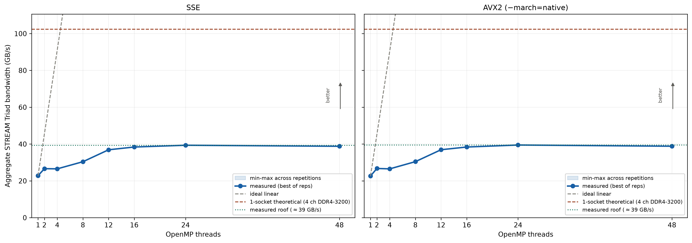

## Build

```bash
cmake -B build -DCMAKE_BUILD_TYPE=Release
cmake --build build --parallel
```

Targets: `pricer` (the option pricer), `profiler`, `scaling` (the OpenMP scaling
instrument), `regime-control` (the numerics gate), `regime-sweep` (the timed regime
sweeps), `calibrate-alpha` (the reduction-cost calibration), and `stream`.

An optional compile-commands symlink improves IDE integration:

```bash
ln -sf build/compile_commands.json compile_commands.json
```

### Requirements

This project requires **GCC 16** (for C++23 support).

On Ubuntu:

```bash
sudo add-apt-repository ppa:ubuntu-toolchain-r/test
sudo apt update
sudo apt install gcc-16 g++-16
```

The plotting scripts require [`uv`](https://docs.astral.sh/uv/getting-started/installation/),
which creates an isolated environment automatically from each script's inline metadata:

```bash
curl -LsSf https://astral.sh/uv/install.sh | sh
```

### Dependencies

| Library  | Source                           | Purpose                                         |
|----------|----------------------------------|-------------------------------------------------|
| `Eigen`  | fetched via CMake `FetchContent` | Sparse linear algebra, dense matrix exponential |
| `Catch2` | fetched via CMake `FetchContent` | Unit testing framework                          |

No system-level installs are required beyond GCC 16. CMake downloads Eigen and Catch2 automatically on first configure.

### Run tests

```bash
cd build && ctest --output-on-failure
```

The regime tests are their own binary (`regime_tests`) and cover the synthetic operator,
the CA kernels, the Krylov machinery, the dimensionless coordinates, and the non-normality
laws - including the tensor-law and spectral-degeneracy results in
[the asset-dimension law](#the-asset-dimension-law).

## Model

3-asset Black-Scholes PDE in log-price coordinates, solved backward in pseudo-time $\tau$ from 0 (payoff) to T (price):

$$
\frac{\partial u}{\partial \tau} = \frac{1}{2} \sum_{d,d'} \rho_{dd'} \sigma_d \sigma_{d'} \frac{\partial^2 u}{\partial x_d \partial x_{d'}} + \left(r - \tfrac{1}{2}\sigma_d^2\right) \frac{\partial u}{\partial x_d} - r \, u + b(\tau)
$$

**Basket call payoff:**

$$
u_0(x) = \max\!\left(\sum_d w_d e^{x_d} - K,\ 0\right)
$$

**Rainbow min-call payoff:**

$$
u_0(x) = \max\!\left(\min_d e^{x_d} - K,\ 0\right)
$$

The boundary forcing term $b(\tau)$ for the basket case is encoded as a polynomial $B \cdot s(\tau)$ with $s(\tau) = [\tau^2/2,\, \tau,\, 1]^\top$,
derived from a deep-ITM approximation on ghost nodes outside the grid.
The rainbow case uses modified finite-difference stencils (zero-gamma boundary condition) instead.

Discretization is by second-order central differences on a uniform Cartesian grid with
$x_1$-fastest lexicographic ordering, so every operator is a three-fold Kronecker product
with identity in the undifferentiated directions. The assembled $A$ carries at most 19
nonzeros per row (a 7-point stencil plus $3 \times 4$ mixed-derivative diagonals). Its
bandwidth is $O(N_1 N_2)$, set by the $x_3$ and mixed terms, which rules out banded direct
solvers at scale. $A$ splits as $A_{\text{sym}} + A_{\text{skew}}$ - diffusion, mixed and
reaction terms symmetric, convection skew-symmetric - so it is not symmetric in general,
but $\operatorname{Re}(\lambda) \le 0$ holds, which is what stability of $e^{hA}$ requires.

### Default model parameters

| Parameter                | Value              | Description                                                 |
|--------------------------|--------------------|-------------------------------------------------------------|
| Spot prices $S_0$        | (100, 100, 100)    | Initial asset prices                                        |
| Strike K                 | 100                | Option strike                                               |
| Risk-free rate r         | 0.04               | Continuously compounded                                     |
| Maturity T               | 1.0 year           | Fixed                                                       |
| Volatilities $\sigma$    | (0.30, 0.35, 0.40) | Per-asset annual vol                                        |
| Correlations $\rho$      | (0.50, 0.50, 0.50) | Off-diagonal pairs ($\rho_{01}, \rho_{02}, \rho_{12}$)      |
| Basket weights w         | (1/3, 1/3, 1/3)    | Equal-weight basket                                         |
| Grid half-width $\alpha$ | 2.85               | Log-price domain $\pm \alpha \sigma \sqrt{T}$ per dimension |

## Benchmark: reproducing Niesen-Wright Figure 1

Five methods are compared. Three are time-steppers over `--steps` substeps: Crank-Nicolson
($\theta = 0.5$, fully implicit, second order, one SparseLU factorization per run), and two
alternating-direction-implicit splittings, Douglas-Rachford (three direction-split solves
per step) and Hundsdorfer-Verwer (a Douglas-Rachford predictor with a corrector). The
remaining two exponentiate the operator: `ME` forms $e^{T\tilde{A}}$ in one shot by scaling
and squaring with an $\infty$-norm early exit, choosing its own substep count; `KSM-EI` is
the Krylov exponential integrator, building an incremental Arnoldi basis per step and
exponentiating the small Hessenberg matrix $H_m$, with the basis grown until an a-posteriori
estimate meets `--tol`. `./build/pricer --help` lists the flags in full.

The benchmark reproduces Figure 1 of Niesen and Wright: log-log plots of ODE error against
CPU time for all five methods, across both option types and both grid sizes.

```bash
bash scripts/sweep/sweep_n31.sh              # sweeps and caches the n=31 referee
bash scripts/sweep/sweep_n61.sh              # likewise at n=61
uv run scripts/plots/benchmark_plots.py      # writes scripts/plots/benchmark_plots.png
```

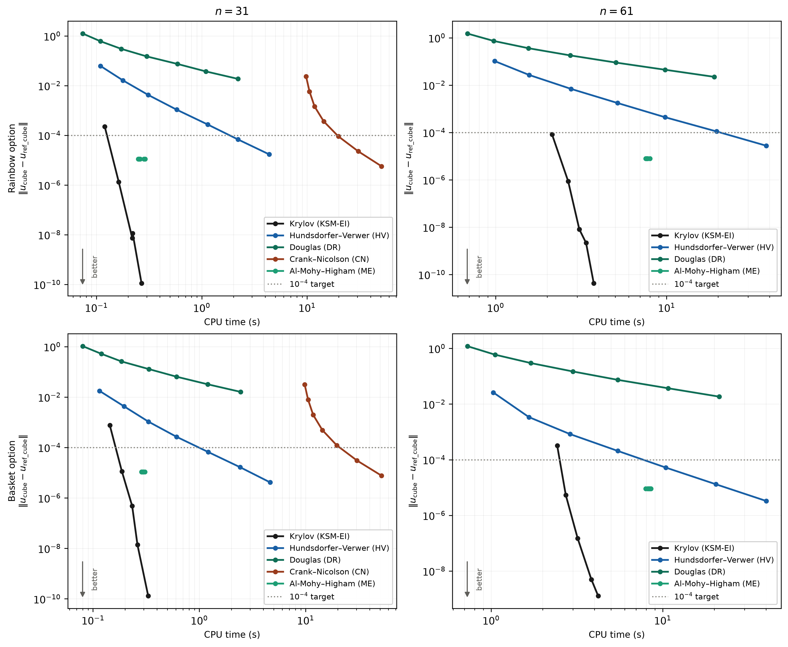

The method ordering matches theory. The Krylov integrator dominates in the $\sim 10^{-4}$
accuracy band that finance cares about; Crank-Nicolson's non-monotone stiff-mode ringing
($R(-\infty) = -1$) is visible as predicted.

**The measurement is against the exact ODE solution, not the analytic price.** Before each
option type is benchmarked, a high-accuracy matrix-exponential referee is computed at
maximum Taylor degree $m = 55$ and $\theta = 9.9$, giving
$s = \lceil T \lVert \tilde{A} \rVert_1 / \theta \rceil$ internal substeps at a tolerance of
$2^{-53} \approx 1.1 \times 10^{-16}$. Scoring against the analytic price instead would fold
spatial discretization error into a claim about time integration, so the referee is
deliberately a different object from the contestants: the exact solution of the same
semi-discrete system. The error is the Euclidean norm over the $9 \times 9 \times 9$ grid
neighborhood centered on the spot rather than the value at a single node, so a lucky
cancellation at one grid point cannot flatter a method. The referee dominates the cost at
large grids, so the sweep scripts compute it once (`--save-referee`) and reuse it
(`--referee-dir`).

This reproduction is the **control**, not the result. On an autonomous linear problem the
one-shot matrix exponential is genuinely hard to beat: at $n=15$ time-exactness buys
nothing, because every method is already pinned at the spatial error (0.066). The Krylov
integrator's structural advantages - adaptivity, no step-count trial-and-error, and a
retained trajectory that a one-shot exponential discards - only cash out away from this
benign regime.

Stiffness grows sharply with refinement: the smallest eigenvalue moves from $-24$ at
$n=11$ to $-2924$ at $n=101$. Over-solving in time on a coarse grid is therefore pointless,
and the commercial motivation for the whole project is the cost at the other end - Niesen
and Wright report $\sim 700$ s for Hundsdorfer-Verwer to reach one basis point at $61^3$.

## Profile and roofline

At $n=61$ (226,984 DOFs, 4.23M nonzeros, $\approx 49$ MB CSC) over 100 steps, the KSM-EI
solve is overwhelmingly SpMV and Gram-Schmidt. The dense $\exp(H_m)$ is noise:

| Grid | $\bar{m}$ | SpMV  | Gram-Schmidt | dense expm | other |
|------|-----------|-------|--------------|------------|-------|
| n=31 | 7.60      | 82.9% | 11.7%        | 0.40%      | 4.9%  |
| n=53 | 8.42      | 77.7% | 16.8%        | 0.34%      | 5.1%  |
| n=65 | 9.24      | 76.0% | 18.0%        | 0.21%      | 5.9%  |
| n=73 | 9.89      | 75.2% | 18.8%        | 0.15%      | 5.9%  |
| n=89 | 11.34     | 70.3% | 23.8%        | 0.08%      | 5.8%  |

Basket at `tol = 1e-8`; reproduce with `bash scripts/scaling/scaling_mn.sh`. Gram-Schmidt's
share grows because $m$ grows and modified Gram-Schmidt is quadratic in $m$.

Both kernels sit far below the compute ceiling. The cache-aware roofline shows why, and
where the CA opportunity is:

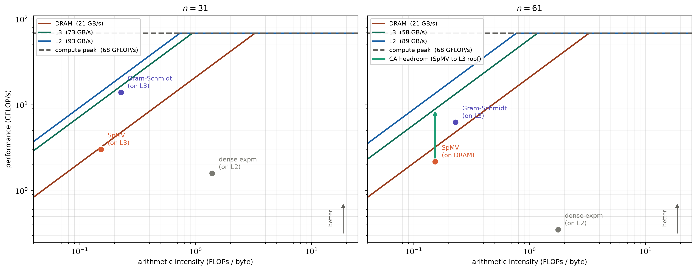

| Grid | Kernel       | AI (FLOP/B) | Achieved (GFLOP/s) | Resident tier |
|------|--------------|-------------|--------------------|---------------|
| n=31 | SpMV         | 0.153       | 3.02               | L3            |
| n=31 | Gram-Schmidt | 0.227       | 13.91              | L3            |
| n=61 | SpMV         | 0.153       | 2.17               | **DRAM**      |
| n=61 | Gram-Schmidt | 0.230       | 6.24               | L3            |

Single-core roofs on puffin: DRAM 20.9 GB/s, L3 58.2 GB/s, L2 88.6 GB/s, compute peak
68.1 GFLOP/s (measured with an FMA loop, `build/fma-loop`, x86-64 only). At $n=61$ SpMV has spilled to
DRAM, and the vertical distance from the measured point to the L3 roof *at the same
arithmetic intensity* is exactly the traffic a matrix-powers reformulation would recover.

The attainable gain from moving a kernel one tier up the hierarchy is

$$
\text{gain} = \frac{\min(BW_{\text{fast}} \cdot AI,\ \text{peak})}{\min(BW_{\text{slow}} \cdot AI,\ \text{peak})},
$$

which collapses to the bandwidth ratio only while *both* roofs are still sloped. It must
bend down once the fast roof reaches the compute ceiling - which the $s\times$-higher
arithmetic intensity of a matrix-powers kernel can actually reach. Quoting a flat
bandwidth ratio as "the CA speedup" overstates the ceiling.

## OpenMP scaling study

The `scaling` executable is the measurement instrument for the strong- and
weak-scaling analysis of the baseline (sequential-algorithm) KSM-EI solver,
prior to GPU acceleration. It measures how the two hot kernels of one Arnoldi
cycle respond to added cores - it does **not** measure solution accuracy.

The thesis is that the two kernels fail to scale for two *different* reasons,
and each motivates a distinct communication-avoiding mechanism:

| Kernel       | Bound                                                 | Communication | CA mechanism it motivates                                  |
|--------------|-------------------------------------------------------|---------------|------------------------------------------------------------|
| SpMV         | bandwidth (data movement across the memory hierarchy) | vertical      | matrix-powers / cache-blocking (fewer hierarchy crossings) |
| Gram-Schmidt | synchronization (global reductions in modified GS)    | horizontal    | s-step / block orthogonalization (fewer global reductions) |

This split is what the [regime analysis](#regime-analysis) later turns into two
independent dimensionless axes.

To make both ceilings visible and attributable, the harness:

- **Freezes the Krylov dimension at `m = 8`** (`--m`), with the convergence
  check disabled, so the GS/SpMV work ratio does not drift and any runtime
  change across `P` is attributable to hardware rather than a changing algorithm.
  The genuine `m(n)` growth is measured separately and reported as an
  independent numerical-analysis finding.
- Uses a **hand-rolled CSR, row-partitioned SpMV**: each thread is the sole
  writer of a contiguous, disjoint slice of the output vector (no atomics),
  with partition seams aligned to the cache line (8 doubles) to avoid false
  sharing.
- Runs **modified Gram-Schmidt with parallel global reductions**, exposing the
  synchronization cost directly.
- Reports **per-kernel** timings (SpMV / Gram-Schmidt / dense expm / other) so a
  single sweep yields SpMV's plateau *and* Gram-Schmidt's roll-off on one axis.
- Takes the **median** of five to seven timed repeats after discarding a warm-up
  iteration, with the inter-quartile range as the error bar. On a boost-enabled
  chip, timing noise is right-skewed; the median reports a *sustainable*
  throughput, whereas the min would report an unsustainable boost spike.

### Two initialization arms (`--arm`)

Placement, not core count, governs whether a bandwidth-bound kernel scales. This
is set up as a controlled A/B experiment:

- **Arm A - naive master-thread init.** The matrix is filled from thread 0;
  first-touch parks the whole matrix on one L3 slice. Prediction: the `n = 61`
  SpMV curve stays flat / DRAM-bound at all `P`.
- **Arm B - parallel first-touch.** Each thread first-touches exactly the row
  partition it will later compute on, distributing the matrix across the engaged
  slices. Prediction: the `n = 61` SpMV curve transitions once the aggregate
  engaged-slice L3 covers the 52.8 MiB working set (at $P \approx 12$ under `close`).

The two arms turn out to be indistinguishable, for a reason that is itself the
finding - see [the locality control](#why-the-transition-happens-locality-control---sched).

### Execution controls

All runs on **puffin** (AMD Threadripper 3960X: 24 cores, 8 CCX / L3 slices,
3 cores per slice). The sweep scripts set:

- `OMP_PLACES=cores`: per-physical-core places from the machine topology.
- `OMP_PROC_BIND=close`: fill one CCX before engaging the next, so per-CCX L3
  bandwidth steps appear as discrete risers.
- `OMP_NUM_THREADS=P`: the swept core count, CCX-boundary aligned
  (`1, 3, 6, ..., 24`). SMT lanes are excluded (no point exceeds the 24 physical cores).

### Running the study

```bash
cmake -B build -DCMAKE_BUILD_TYPE=Release
cmake --build build --parallel

# Strong scaling: n=31 and n=61, both init arms, P in {1,3,6,...,24}
bash scripts/scaling/scaling_strong.sh      # writes data/scaling/scaling_strong.csv

# Weak scaling: n(P) = n1*P^(1/3) rounded odd, P in {1,5,9,13,17,21,24}
bash scripts/scaling/scaling_weak.sh        # writes data/scaling/scaling_weak.csv

# m(n) Krylov-growth (the quarantined numerical-analysis finding)
bash scripts/scaling/scaling_mn.sh          # writes data/scaling/mn_growth.csv

# Locality experiment: what actually causes the transition (see below)
bash scripts/scaling/scaling_locality.sh    # writes data/scaling/scaling_locality.csv

# Figures for all deliverables
uv run scripts/plots/scaling_plot.py        # writes scripts/plots/scaling_*.png
```

The sweep scripts honor `STEPS`, `M`, `REPEATS`, `REDUCE`, and `OPTION` environment
overrides (and `ARM` for the weak sweep). A single `scaling` invocation measures
one `(arm, n, P)` point and appends one CSV row; run it directly to reproduce a
single point:

```bash
OMP_NUM_THREADS=12 OMP_PLACES=cores OMP_PROC_BIND=close \
  ./build/scaling --arm B --n 61 --steps 100 --m 8 --repeats 7 \
                  --csv data/scaling/scaling_strong.csv
```

### Scaling Plots

| Figure                  | Content                                                                                                                  |
|-------------------------|--------------------------------------------------------------------------------------------------------------------------|
| `scaling_strong.png`    | Per-kernel strong-scaling curves, `n=31` and `n=61`, both arms - SpMV's plateau/transition and Gram-Schmidt's staircase. |
| `scaling_ab.png`        | The init-strategy A/B contrast at `n=61` SpMV - arm A flat vs arm B transition.                                          |
| `scaling_weak.png`      | Per-kernel weak-scaling efficiency `T(1)/T(P)` vs `P`, tier crossings annotated.                                         |
| `scaling_mn.png`        | The quarantined `m(n)` Krylov-growth curve.                                                                              |
| `scaling_reduction.png` | Gram-Schmidt wall-clock under the calibrated tree reduction vs the `O(P)` redundant scan it replaced.                    |

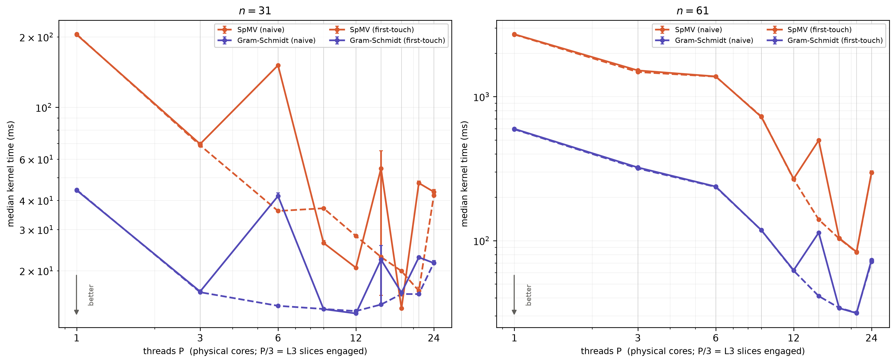

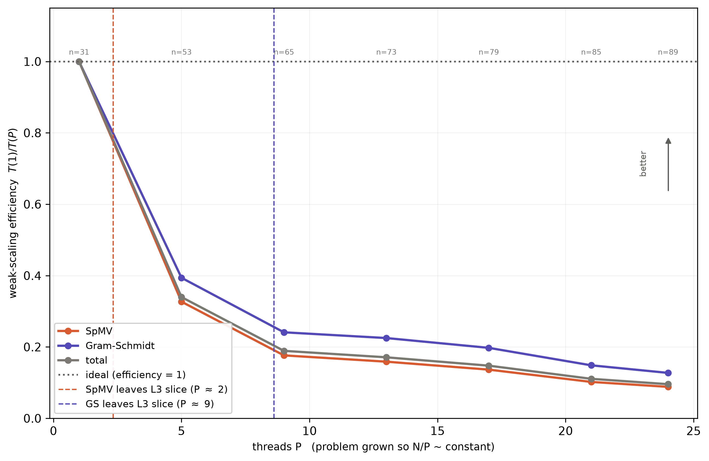

### Why the transition happens? Locality control (`--sched`)

At `n = 61` the SpMV runtime drops superlinearly (36.7x on 24 cores) with a knee at
`P = 12`. The hypothesis: once each CCX's share of the matrix ($3 \times 52.8/P$ MiB)
fits in its own 16 MiB L3 slice and stays resident across the `ei_steps` times `m`
SpMVs, reads come from L3 instead of DRAM. Quantitatively this checks out - the
implied per-core bandwidth is 16.7 GB/s at `P=1` (near the 21 GB/s DRAM roof) and
25.5 GB/s at `P=24` (above DRAM, below the 58 GB/s single-core L3 roof), and the
implied *aggregate* bandwidth crosses the socket DRAM ceiling (~95 GB/s) exactly
at `P=12`, which is impossible from DRAM and therefore proves L3 residency.

The naive-vs-first-touch init arms (`--arm`) **cannot** test this: the 3960X is
single-NUMA, and Zen 2 L3 is a per-CCX victim cache, so L3 residency is set by
which core *accesses* a row, not by which thread first-touched the page. Both
arms use the same row partition and produce identical curves.

The real controlled experiment is over the **compute schedule** (`--sched`), which
changes *only* which rows each core reads. `scripts/scaling/scaling_locality.sh` runs all
three at `n=61`:

| `--sched` | What it does                                             | Prediction                                                                                                                                                   | Measured (SpMV speedup at `P=24`; aggregate GB/s at `P=12`) |
|-----------|----------------------------------------------------------|--------------------------------------------------------------------------------------------------------------------------------------------------------------|-------------------------------------------------------------|
| `block`   | contiguous band per core, fixed across SpMVs             | transition at `P=12` (locality-preserving control)                                                                                                           | **confirmed** - 36.7x, knee at `P=12`, 176 GB/s             |
| `cyclic`  | cache-line blocks dealt round-robin, fixed               | **still** transitions - scatter leaves per-CCX *volume* unchanged, and volume alone should set L3 residency                                                  | **refuted** - 7.0x, no knee, 36 GB/s                        |
| `rotate`  | contiguous bands, but the band rotates by one every SpMV | transition **vanishes** - each CCX sweeps the whole matrix over the reuse window, so its slice never retains a cache-fitting subset and every SpMV pays DRAM | **confirmed** - 6.6x, no knee, 66 GB/s                      |

At `P=12` only `block` carries an aggregate bandwidth that DRAM cannot supply, so the
transition is genuinely L3 residency and not a scheduling coincidence. The identical
arm-A/arm-B result therefore stops being an embarrassment and becomes the control that
establishes the transition is a locality effect - the "before" that the
communication-avoiding matrix-powers reformulation improves on.

The refuted `cyclic` prediction is a result in its own right, and it sharpens the CA
argument. Per-CCX *volume* is not sufficient for residency: dealing cache-line blocks
round-robin leaves each CCX holding the same number of bytes but scattered across the whole
matrix, and the arm collapses to roughly the `rotate` curve (7.0x vs 6.6x) rather than the
`block` one (36.7x). **Contiguity, not volume, is what keeps a slice resident** - which is
exactly the property a matrix-powers tiling is built to exploit, and exactly the property
the [scattered arm of the vertical sweep](#the-vertical-mechanism-a-measured-shortfall)
destroys on purpose.

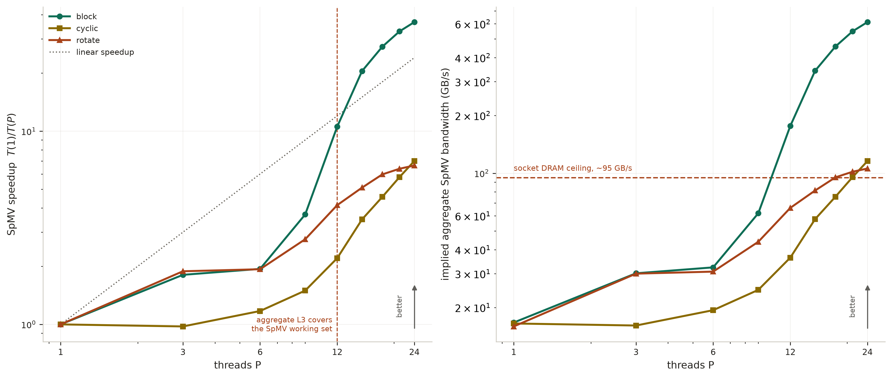

## Regime analysis

The scaling study says the baseline solver is memory-bound and synchronization-bound. It
does not say whether a CA reformulation would *help*, or where. The regime analysis is the
answer to that: a **dimensionless map** whose two axes are the two mechanisms, with a
predicted crossover at 1 on each, plus a synthetic instrument that can be dialed to any
point on the map and a real Black-Scholes operator that is *placed* on it by measurement.

The design rule that keeps the map non-circular: **coordinates are predictors, computed
before a run from $N$, the sparsity pattern, the spectrum, and the machine constants;
outcomes (wall-clock, orthogonality loss, achieved bytes) test the boundaries and never
enter a coordinate.** In particular $R_h$'s numerator is a machine constant times a tree
depth, never a measured fraction of runtime. This is enforced structurally: the predictor
lives in [`include/regime.hpp`](include/regime.hpp), which never sees a timer.

### The coordinates

| Axis  | Definition                                           | Mechanism it governs                                       | Scales like     |
|-------|------------------------------------------------------|------------------------------------------------------------|-----------------|
| $R_v$ | Arnoldi working set / aggregate last-level cache     | **vertical** - matrix-powers tiling, avoiding DRAM traffic | $\sim 1/P$      |
| $R_h$ | reduction cost / compute per core between reductions | **horizontal** - s-step, cutting the reduction count       | $\sim P \log P$ |

Both crossovers are predicted at $R = 1$ ($\theta_v = \theta_h = 1$), giving four corners:
neither mechanism (lower-left), horizontal only (lower-right), vertical only (upper-left),
and both (upper-right).

The Krylov dimension $m$ was **demoted from an axis to a modulator**. It moves working
sets, so it moves $R_v$, but it is not itself a portable coordinate: two machines with the
same $m$ can sit on opposite sides of $\theta_v$.

$R_h$'s numerator needs a magnitude, not just a shape in $P$, or $\theta_h$ cannot be drawn
at all. `calibrate-alpha` measures it directly as a bare scalar all-reduce over an empty
team - no payload, no application - and the model fitted to it is

$$
t_{\text{reduce}}(P) = t_{\text{intra}} \cdot \text{intra levels}(P) + t_{\text{cross}} \cdot \min(\text{cross levels}(P),\ L^{*}).
$$

On puffin: $t_{\text{intra}} = 120.8$ ns, $t_{\text{cross}} = 652.8$ ns (a cross-CCX tree
level costs 5.4x an intra-CCX one), and $L^{*} = 2.20$ - past roughly two cache-domain
crossings, subtree concurrency hides the rest. Measured tree all-reduce latency runs from
9.6 ns at $P=1$ to 1.70 $\mu$s at $P=24$ ($R^2 = 0.98$ against the model). The cost is set by
how many cache-domain boundaries the tree crosses, not by core count - which is precisely
why this coordinate cannot be measured on a virtualized topology.

`scripts/regime/calibrate_alpha.sh` times three primitives, which also sizes the correction
to an earlier instrument: the naive barrier-plus-$O(P)$-redundant-scan reduction costs
2.91 $\mu$s at $P = 24$ against the tree's 1.70 $\mu$s. That difference matters for the
model, but not for the application's wall-clock.

### The instrument and its gates

`regime-control` is a **numerics gate, not a timing run**: nothing is threaded or timed,
and no result depends on the host. It establishes that the synthetic instrument's a-priori
arithmetic predictions hold before any communication claim is built on them.

| Control | Claim under test                                                                        | Status                              |
|---------|-----------------------------------------------------------------------------------------|-------------------------------------|
| C1      | the Kronecker-sum spectrum is analytic and correct                                      | gate                                |
| C2      | the scatter knob is an exact similarity transform (so a pure-$R_v$ dial exists)         | gate                                |
| C3      | measured $m$ obeys the Hochbruck-Lubich spectral bound                                  | gate (Hermitian PSD)                |
| C3b     | a spectral shift leaves $m$ fixed                                                       | finding                             |
| C4      | $\kappa$ of the matrix-powers basis equals the row-scaled Vandermonde from the spectrum | gate when normal, finding otherwise |
| C5      | the CholeskyQR certificate $\kappa \le u^{-1/2}$ is sound                               | gate                                |
| C5b     | worst-case block count over the physical ensemble ("small-$m$ safety")                  | finding                             |
| C6      | where the operator is non-normal, does the spectral prediction survive?                 | finding                             |

C2 is load-bearing. The scatter knob permutes the operator symmetrically, $P A P^\top$,
which moves bytes and provably nothing else; if it moved the spectrum, the "pure $R_v$
line" would be an illusion and every vertical result would be confounded.

The sweep runs in five phases - gate, confound, $m$-range, non-normal, and finally the
real discretized BS operator (`--real-bs`) with its actual discounted payoff, swept across
grids. That last phase is *transfer by measurement*: it lands the real operator on the same
$(R_v, R_h)$ plane as the synthetic instrument.

### Numerical results: the certificate line

#### Basis conditioning and the confound control

The certified s-step block width $s_{\max}$ is predicted from the spectrum alone (a
row-scaled Vandermonde), then measured. Where a closed-form spectrum exists the prediction
is **integer-exact on 20 of 21 runs**; the single exception is the most violently
non-normal point in the sweep ($\gamma = 0.4$, $\kappa(X) = 7.7 \times 10^8$) and is off by
one step. Every deviation larger than that lives in the variable-advection arm - the family
the [log-robustness law](#non-normality-the-log-robustness-law) explicitly excludes. The
real Black-Scholes operator deviates by at most one step at any grid measured.

The obvious confound is that $s_{\max}$ might just be tracking $m$. It does not:

| Experiment      | What varies                                                            | Certified $s_{\max}$ |
|-----------------|------------------------------------------------------------------------|----------------------|
| spectrum pinned | $m = 5, 6, 7, 8, 9, 11, 12$ (moved by $h$ and tol)                     | **flat at 7**        |
| $m$ pinned at 5 | spectrum scale $\sigma \in \{1,2,4,8\}$, shift $\mu \in \{0, 2, 3.5\}$ | **4 to 14**          |

Safety is a property of the spectrum, not of the Krylov dimension.

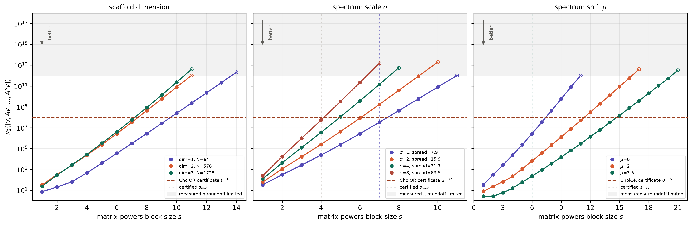

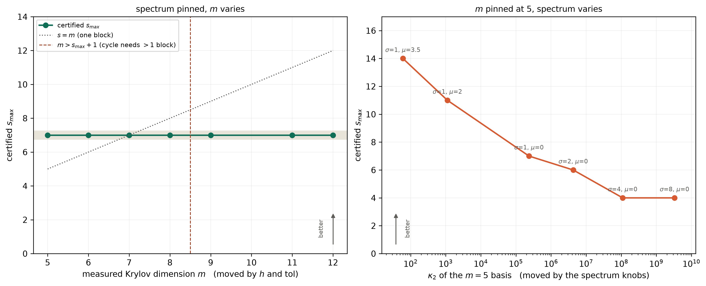

#### The reduction ledger

Modified Gram-Schmidt performs $1 + m(m+3)/2$ global reductions per Arnoldi cycle. The
stable s-step arm (matrix powers + CholQR2) performs $1 + 2\lceil m/(s_{\max}+1)\rceil$:

| $m$ | MGS reductions | s-step + CholQR2 | cut   |
|-----|----------------|------------------|-------|
| 5   | 21             | 3                | 7.0x  |
| 8   | 45             | 3                | 15.0x |
| 9   | 55             | 5                | 11.0x |
| 11  | 78             | 5                | 15.6x |
| 12  | 91             | 5                | 18.2x |

Across the real problem's measured window $m = 8\text{-}11$ that is an **11-16x cut in
reduction count**, at the $s_{\max} = 7$ certified for this spectrum
(`scripts/regime/regime_control.sh`).

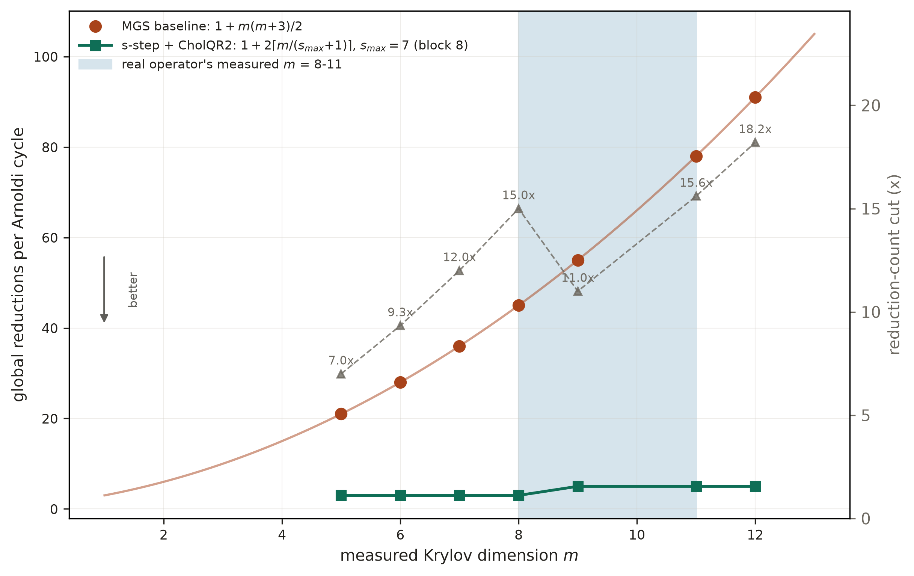

**Small-$m$ safety.** The real operator's Krylov dimension is small and grows slowly -
$m = 6\text{-}8$ across the eigensolvable grids $n = 10\text{-}20$, and 7.6 to 11.3 across
$n = 31\text{-}89$ in production. Because a certified block yields $s_{\max}+1$ vectors, an
entire Arnoldi cycle fits in **2-3 blocks**. This is the argument that makes s-step viable
for this integrator at all: the machinery never has to run deep enough for monomial-basis
conditioning to become the dominant risk.

#### Non-normality: the log-robustness law

The spectral prediction of $s_{\max}$ assumes normality. The real operator is not normal
(mixed-derivative cross terms plus convection). The rigorous two-sided bound is that the
prediction error in decades is at most $\log_{10}\kappa(X)$, the eigenvector conditioning.
Measured, the data sits far below that line and grows only *logarithmically*:

| Mechanism                                                      | Fitted slope of (error in decades) vs $\log_{10}\kappa(X)$ |
|----------------------------------------------------------------|------------------------------------------------------------|
| constant-coefficient (advection, correlation, $\rho + \gamma$) | **0.069**                                                  |
| variable-coefficient advection (position-dependent ramp)       | **0.250** (~4x steeper)                                    |

The two slopes differ by a factor of four, so the law is **scoped to the
constant-coefficient family**, not mechanism-independent - which is exactly why the
variable-advection knob exists in the instrument.

Both are fitted on the canonical axis. This matters for the constant-coefficient arm, whose
zero-correlation half is a pure Kronecker sum: its axes are interchangeable, so the dense
$\kappa(X)$ there is degenerate and inflated by up to $173\times$ (see [the asset-dimension
law](#the-asset-dimension-law)). Fitted on that dense axis the slope reads 0.061 instead of
0.069 - a shift small enough not to disturb the conclusion, but the two arms would have been
compared on axes of different validity, since the variable-coefficient arm ramps a single
axis and therefore keeps a simple spectrum and a sound dense value. The `--real-bs` and
variable-advection points legitimately retain the dense value for the same reason;
`regime_plot.py` reports the split (19 canonical, 11 dense) on every run.

A *decade* here is one factor of ten in the basis condition number: the error plotted is
$\lvert \log_{10}\kappa_{\text{meas}} - \log_{10}\kappa_{\text{pred}} \rvert$, so 1.0
decades means the prediction was wrong by a factor of ten. The unit is chosen because it
converts directly into block width. Each extra power appended to
$[v, Av, \ldots, A^s v]$ multiplies its condition number by a roughly constant factor,
measured at a median of 1.05 decades per power over the swept family (inter-quartile range
0.95 to 1.12), so the figure marks one $s$-step at 1.2 decades. An error below that line
cannot move the certified block width by a full step.

The real Black-Scholes operator is placed on this figure as a test point, excluded from
every fit. Its prediction error runs 0.19 to 0.85 decades at $\kappa(X)$ up to $2.3 \times
10^3$, comfortably **under one $s$-step** at every grid measured.

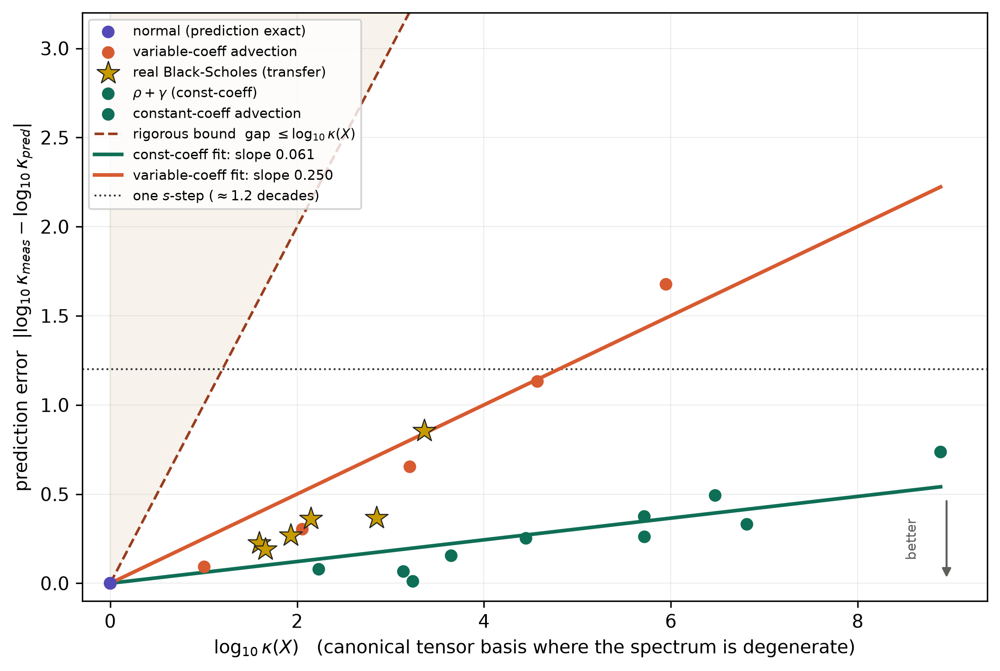

Operator-by-operator, what the spectral prediction needs is normality; definiteness and
separability are conveniences:

| Operator                    | Normal? | Definite?  | Separable? | Spectral prediction         |
|-----------------------------|---------|------------|------------|-----------------------------|
| Laplacian                   | yes     | PSD        | yes        | exact (closed form)         |
| shift $\mu$                 | yes     | indefinite | yes        | exact ($\kappa(X) = 1$)     |
| correlation $\rho$          | yes     | PSD        | no         | exact (dense eigensolve)    |
| constant $\gamma$ advection | no      | -          | yes        | survives (< 1 step)         |
| $\rho + \gamma$             | no      | -          | no         | survives (< 1 step)         |
| variable $\gamma$ advection | no      | -          | no         | must be measured (> 1 step) |

#### The asset-dimension law

How does $\kappa(X)$ grow with the number of assets $d$? This axis matters because the
thesis grows the asset count, not the grid: an earlier refinement study swept grid $N$ at
fixed $d = 3$ and found $\kappa(X)$ flat, which confirms the mesh-Peclet reading
($\log\kappa(X) \sim d\, n_1 \gamma$ with $\gamma \sim C/n_1$, so $n_1$ cancels) and says
nothing about $d$.

**The law is linear in $d$, with a slope known in closed form.** `build_synthetic` applies
the cross term using `stride[0]` and `stride[1]` only
([`include/synthetic.hpp:324`](include/synthetic.hpp:324)), so there is exactly **one
coupled pair at every $d$, never $C(d,2)$**, and the operator factors as a Kronecker sum
$A_d = B_{01} \oplus T \oplus \cdots \oplus T$. A Kronecker product multiplies singular
values, so

$$
\kappa(X) = \kappa(X_{01})\, \kappa(X_1)^{\,d-2}
\qquad\Longrightarrow\qquad
\log_{10}\kappa(X) = 0.40499\, d + 0.01422,
$$

with the slope $0.404995 = \log_{10}\kappa(X_1)$ analytic. The observed $d = 2 \to 3$
increment is $0.40500$, and the formula reproduces both degeneracy-free points to
$3 \times 10^{-7}$.

The dense $\kappa(X)$ that a straightforward eigensolve returns must not be fitted along
$d$, because from $d = 4$ it is not a property of the operator at all. Axes $2 \ldots d-1$
carry no cross term, so interchanging any two of them is an exact symmetry of $A$: the
spectrum repeats, and inside a repeated eigenspace every basis is admissible, so the value
reported is whichever basis the eigensolver's rounding happened to produce.

| $d$ | $N$  | distinct eigenvalues | max multiplicity | dense $\kappa(X)$ over 8 permutations | spread           | canonical $\kappa(X)$ |
|-----|------|----------------------|------------------|---------------------------------------|------------------|-----------------------|
| 2   | 16   | 16                   | 1                | 6.6713 to 6.6713                      | $1+3\text{e-}15$ | 6.671                 |
| 3   | 64   | 64                   | 1                | 16.951 to 16.951                      | $1+8\text{e-}14$ | 16.951                |
| 4   | 256  | 144                  | 4                | 81.8 to 314.3                         | 3.84x            | 43.073                |
| 5   | 1024 | 256                  | 9                | 373.9 to 2903                         | 7.76x            | 109.45                |

A symmetric permutation $P A P^{\top}$ is an exact similarity, so any function of the
operator is invariant under it. The dense value is invariant to rounding while the spectrum
is simple and moves by a factor of 3.84 at $d = 4$ and 7.76 at $d = 5$ once it is not. The
canonical value is exactly invariant across every permutation. Reproduce with
`ctest -R "regime.*symmetric permutation"`, which asserts both halves.

`regime-control` therefore reports a canonical, basis-independent value alongside the dense
one, as the `kappa_X_struct` column
([`structured_kappa_X`](include/regime_control_support.hpp:313)):

| $d$ | $N$  | `kappa_X_struct` (canonical) | dense `kappa_X` | spectrum                      |
|-----|------|------------------------------|-----------------|-------------------------------|
| 2   | 16   | 6.671                        | 6.671           | simple (agree to 3e-7)        |
| 3   | 64   | 16.95                        | 16.95           | simple (agree to 3e-7)        |
| 4   | 256  | 43.07                        | 109.5           | degenerate: dense meaningless |
| 5   | 1024 | 109.4                        | 5.2e3           | degenerate: dense meaningless |
| 6   | 4096 | 278.1                        | 3.7e4           | degenerate: dense meaningless |

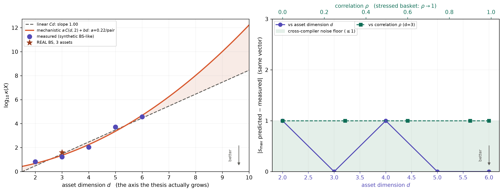

The correlation arm ($n_1 = 8$, $d = 3$) is sound wherever the cross term is actually
present: it leaves a single clean axis, too few to interchange, so the spectrum stays simple
and the dense values match `kappa_X_struct` exactly at every $\rho > 0$. The $\rho = 0$ end
of that arm is the exception, and it is the *most* degenerate point in the study - with no
cross term at all the operator is a pure Kronecker sum, all three axes are interchangeable,
and only 89 of its 512 eigenvalues are distinct (max multiplicity 21):

| $\rho$                       | 0         | 0.3   | 0.6    | 0.9    | 0.99   |
|------------------------------|-----------|-------|--------|--------|--------|
| `kappa_X_struct` (canonical) | **688.0** | 851.8 | 1566.9 | 2277.9 | 3405.2 |
| dense `kappa_X`              | *11350*   | 851.8 | 1566.9 | 2277.9 | 3405.2 |

So **correlation raises $\kappa(X)$ monotonically**, by about $5\times$ across the full
range. An earlier reading of this arm had it the other way - correlation *reducing*
$\kappa(X)$ from $1.14 \times 10^4$ down to 852 - but that took the degenerate $\rho = 0$
dense value as its anchor, and permuting that same operator returns anything from
$4 \times 10^4$ to $1.5 \times 10^6$. There was no fall to explain.

Dimension still dominates, though not because correlation is harmless: $\rho$ across its
entire admissible range buys about 1.7 assets' worth of conditioning ($4.95\times$, against
$2.54\times$ per asset), and $\rho \le 1$ while $d$ is unbounded. Correlation never helps.

The practical consequence is unchanged by the correction: **measure the block width at high
$d$ rather than trusting a conservative a-priori bound**, because $\kappa(X)$ grows
geometrically in $d$ while staying flat under grid refinement.

The law's scope is the synthetic instrument. The real basket operator couples all three
asset pairs ([`rho_off = {0.50, 0.50, 0.50}`](include/regime_control_support.hpp:74)), so
$C(d,2)$ is the right count there and the tensor identity, which rests on one coupled pair,
does not extend to it. Two smaller cautions travel with the numbers: two conventions for
$\kappa(X)$ coexist in the codebase - the un-normalized analytic
[$r^{d(n_1-1)}$](include/synthetic.hpp:167) and the unit-2-norm value the sweeps record - and
they must not be fitted against one another, though they are close in practice (665 against
a canonical 688 at $n_1 = 8$, $d = 3$, $\rho = 0$).

#### The computability gap, and why Fourier does not close it

The certificate is validated by dense eigensolve, which caps the control at
$N \le 32768$ (`kControlMaxN`), while the performance claims live at $N \sim 10^5$. The
proposed bridge was to exploit the constant-coefficient Toeplitz structure for an analytic
spectrum, avoiding the eigensolve entirely.

**That route is closed.** The cross term factors exactly as $c\,(D \otimes D)$ with
$D = \text{tridiag}(-1, 0, +1)$ (verified, $\max|\text{diff}| = 0$). A diagonal similarity
$\text{diag}(z^j)$ symmetrizes $\text{tridiag}(b, a, c)$ iff $z^2 = c/b$ - and the two
terms demand incompatible $z$ on the same axis: $z^2 = (1-\gamma)/(1+\gamma)$ for
advection-diffusion against $z^2 = -1$ for the cross factor. Numerically, the sine basis
leaves 3.7% off-diagonal mass with the cross term against $2.8 \times 10^{-14}$ without,
and no single $z$ helps (best 0.0373). This fails even at $\gamma = 0$, so the obstruction
is the Dirichlet boundary condition, not the advection.

The consolation is constructive: the tensor identity above gives $\kappa(X)$ at any $d$
from a single $n_1^2 \times n_1^2$ eigensolve - no $N \times N$ solve and no `kControlMaxN`
cap - **for the synthetic operator**. The gap remains open for the real BS operator.

### The horizontal mechanism: a measured null result

The reduction ledger promises an 11-16x cut in reduction *count*. The wall-clock does not
move. Two independent measurements say why, and they agree:

1. **The primitive was never the bottleneck.** Replacing the naive barrier-plus-$O(P)$-scan
   reduction with a proper binary tree - a 1.7x improvement in the bare all-reduce latency
   at $P = 24$ - leaves Gram-Schmidt wall-clock unchanged to within 5% at every core count
   (`scripts/scaling/scaling_strong.sh`, $n = 61$, arm B; one contaminated $P = 15$ launch,
   inflated across *all* kernels, is excluded). libgomp's barrier is already a tree, and the
   barrier itself dominates the scan.
2. **Gram-Schmidt is vector-bound, not reduction-bound.** MGS re-reads column $V_i$ once for
   every $j \ge i$, so $m(m+1)/2$ column reads at $8n$ bytes each. That quadratic is a
   *bandwidth* term, and it is what the roll-off in the scaling study is actually made of.

The map predicted this before the experiment: at production resolution $n = 61$ the real
operator sits at $R_h = 0.080 \ll \theta_h = 1$. The horizontal mechanism has no home on
this machine, and the null result is a *confirmation* of the coordinate, not a failure of
it. **The thesis must lead with the timed number, not the reduction count.**

The upper-right corner - both mechanisms binding simultaneously - is structurally
unreachable on puffin. It is a single-NUMA socket, so no tree in the reduction crosses
anything more expensive than a CCX boundary; reaching $\theta_h$ at a working set that also
exceeds $\theta_v$ needs a reduction cost roughly 25x higher than any this machine can
produce.

### The vertical mechanism: a measured shortfall

`regime-sweep` times a cache-blocked matrix-powers kernel against the untiled baseline
across grids that carry $R_v$ from 0.035 to 86. The modeled traffic ratio - the ceiling the
roofline says tiling could reach - is 4-8x. The measurement is not close:

| Pattern   | Tile level | $R_v$ (1 core) | Measured speedup                     | Modeled traffic ratio |
|-----------|------------|----------------|--------------------------------------|-----------------------|
| banded    | L3         | 0.035 - 2.69   | **0.72 - 1.31x**                     | 4 - 8x                |
| banded    | L2         | 1.12 - 86.1    | **0.37 - 0.89x**                     | 4 - 8x                |
| scattered | L3         | 0.035 - 2.69   | 1.00x (falls back to the naive form) | 4x                    |

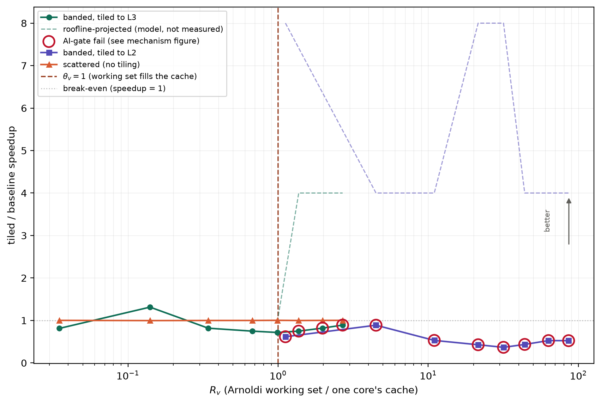

This is a **kernel ceiling, not a refuted boundary**: the tiled arm never reached a
bandwidth-bound regime, so the experiment never got to test $\theta_v$. A diagnostic kernel
that skips the halo entirely (wrong basis, throughput only) separates the two tile levels
cleanly:

| Tile level | Panels / halo           | Removing the halo                                                                             | Reading                                                                                                                                                        |
|------------|-------------------------|-----------------------------------------------------------------------------------------------|----------------------------------------------------------------------------------------------------------------------------------------------------------------|
| L2         | small panels, fat halo  | GFLOP/s recovers toward baseline (1.17 rising to 2.13 against a 2.70 baseline at $n_1 = 400$) | cache-blocking *works*; the shortfall is redundant halo arithmetic traded for DRAM traffic - a bad trade at these panel sizes, not a broken kernel             |
| L3         | large panels, thin halo | GFLOP/s barely moves (2.06 rising to 2.11 against a 2.76 baseline at $n_1 = 400$)             | neither arm is bandwidth-bound; both are capped by something insensitive to cache residency, most consistent with gather latency on the indirect column access |

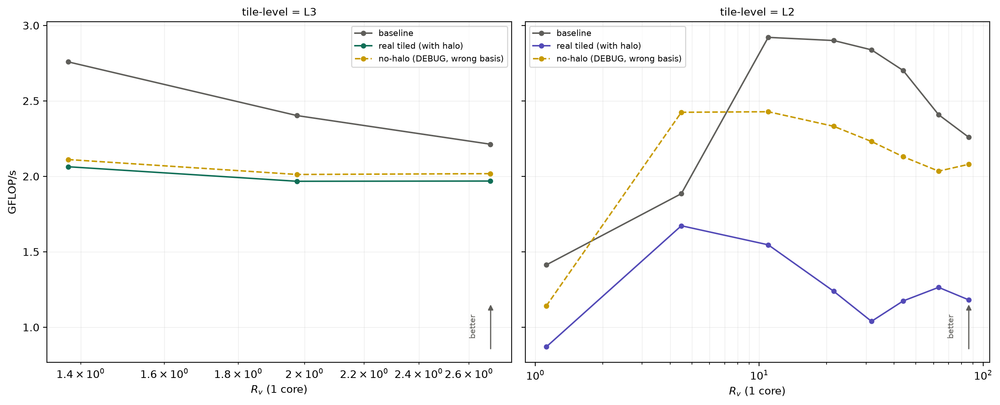

**The scattered arm delimits where the vertical mechanism cannot pay at all.** Matrix-powers
tiling is structurally impossible once the columns scatter, so the sweep falls back to the
naive form and measures 1.00x by construction. Since the scatter knob is a similarity
transform (C2), that boundary is a property of the sparsity pattern alone, at fixed spectrum
and fixed working set.

Two honest limitations: nothing here is a *counted* DRAM measurement, because puffin's
uncore counters need root, so modeled bytes are reconciled against the roofline instead -
weaker evidence, labeled as such on every figure. And the projected curve on
`regime_sweep.png` is an explicit model claim, drawn dashed, never presented as data.

### Block width: two roofs, and which one binds

Everywhere else the block width $s$ is pinned at the certified value, which hides a
question. $s$ is pushed *up* by both mechanisms - a wider block means fewer reductions and
more powers per operator stream - and pulled *down* by two independent ceilings:

- **numerical (the certificate):** $\kappa([v, Av, \ldots, A^s v])$ grows geometrically in
  $s$; past $u^{-1/2}$ the monomial basis leaves the CholeskyQR certificate, so the block
  builds but will not orthogonalize.
- **capacity (the ghost):** the halo is $s \cdot w$ rows per side, so a wider block shrinks
  the panel until none fits and the tiling collapses.

Which arrives first is a joint property of operator and machine, and on puffin it depends
on the tiling level:

| Tile level | $n_1$    | Certificate roof $s$ | Ghost roof $s$ | Binding roof  |
|------------|----------|----------------------|----------------|---------------|
| L3         | 420      | 8                    | 24 or more     | **numerical** |
| L3         | 480, 560 | 6                    | 24 or more     | **numerical** |
| L2         | 420      | 8                    | 3              | **capacity**  |
| L2         | 480      | 6                    | 3              | **capacity**  |
| L2         | 560      | 6                    | 2              | **capacity**  |

(The L3 ghost roof is quoted as `>=` because a panel still fit at every swept $s$; 24 is the
sweep ceiling `S_CEIL`, not a measured collapse. The certificate roof is measured directly:
$\kappa(B_s)$ crosses $u^{-1/2}$ between $s = 8$ and $s = 9$ at $n_1 = 420$.)

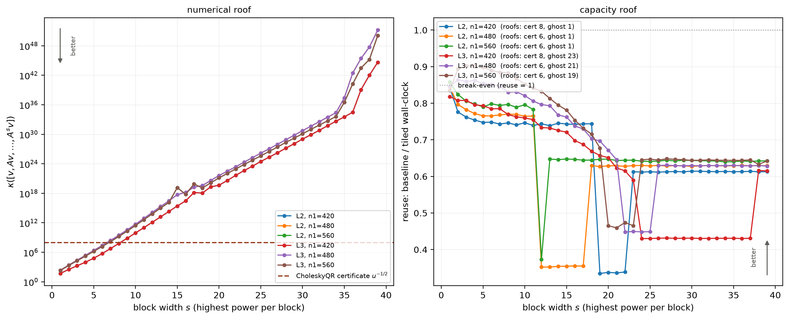

This distinction is actionable. Where the certificate binds, a better-conditioned basis
(Newton, Chebyshev) converts the halo's slack into real reductions. Where the ghost binds,
only a thinner bandwidth or a coarser tiling level moves it - a better basis buys nothing.
Pinning $s$ assumes the first answer without measuring it.

### The map, and where the real operator travels

The measured `--real-bs` points anchor the map; a predicted continuation carries the
operator to production grids. The continuation uses the *same* a-priori placement the
binary uses, and it is validated against the measured coordinates before it is trusted to
extrapolate - the replica currently reproduces every measured $(R_v, R_h)$ to better than
0.001%.

| $n$ | $N$       | $m$ | $R_v$     | $R_h$  | Source                                   |
|-----|-----------|-----|-----------|--------|------------------------------------------|
| 10  | 1,000     | 6   | 0.0019    | 13.53  | measured                                 |
| 20  | 8,000     | 8   | 0.0175    | 1.87   | measured                                 |
| 25  | 15,625    | 8   | 0.036     | 0.904  | predicted                                |
| 61  | 226,981   | 12  | 0.582     | 0.080  | predicted                                |
| 74  | 405,224   | 13  | **1.063** | 0.047  | predicted (first point above $\theta_v$) |
| 120 | 1,728,000 | 15  | 4.74      | 0.0025 | predicted                                |

Bisecting on $n$ puts the $\theta_v$ crossing itself at $n \approx 73$.

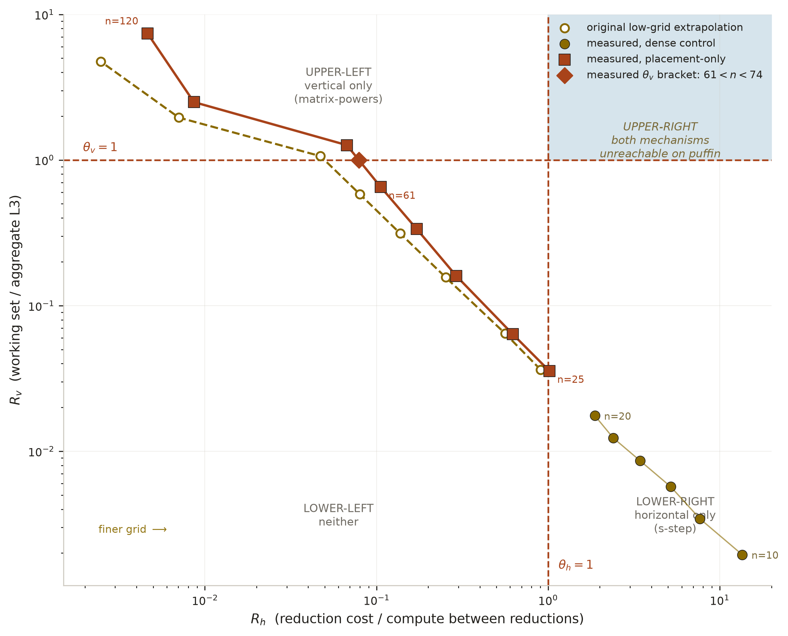

Refinement traces a clear path: **lower-right, then lower-left, then upper-left**, crossing
$\theta_v$ just under $n = 74$ and never entering the upper-right corner.
The interpretation of each leg:

- The measured points read $R_h > 1$ only because the grids small enough to dense-eigensolve
  ($n \le 20$) sit far below any resolution a desk would price at. That is an irrelevant
  regime, not a grid where s-step pays.
- At production resolution the operator is squarely in **vertical-only** territory. The
  mechanism the application needs is matrix-powers tiling; the mechanism the certificate
  work supports is s-step. They are not the same corner.
- The upper-right corner is a **portability claim** on this hardware, not a measurement:
  reaching it needs an interconnect whose reduction cost is roughly 25x puffin's, which
  means crossing a device or node boundary rather than a CCX boundary.

### Running the regime study

All regime executables read machine constants from `--machine amd-3960x`. Calibration comes
first: until $\alpha$ is measured, $R_h$ has a shape in $P$ but no magnitude, and $\theta_h$
has no place on any figure.

```bash
cmake -B build -DCMAKE_BUILD_TYPE=Release && cmake --build build --parallel

# 0. Calibrate the reduction cost (prerequisite, not an experiment)
bash scripts/regime/calibrate_alpha.sh      # writes data/regime/calibrate_alpha_*.csv

# 1. Numerics gate: C1-C6, five phases. Single-threaded and host-independent,
#    so it is embarrassingly parallel - one job per core, merged afterwards.
./scripts/regime/regime_control_launch.sh           # gate first, then fan out to tmux
./scripts/regime/regime_control_launch.sh --status  # who is still running
./scripts/regime/regime_control.sh --merge          # writes data/regime/regime_control.csv

# 2. The asset-dimension law
./scripts/regime/regime_dsweep_launch.sh
./scripts/regime/regime_dsweep.sh --merge   # writes data/regime/regime_dsweep.csv

# 3. The vertical crossover sweep (timed)
bash scripts/regime/regime_sweep.sh         # writes data/regime/regime_sweep{,_nohalo}.csv

# 4. The block-width sweep (timed; run spilled, R_v > 1)
bash scripts/regime/regime_swidth.sh        # writes data/regime/regime_swidth.csv

# Figures
uv run scripts/plots/regime_plot.py         # conditioning, confound, reductions,
                                            # non-normality, trajectory
uv run scripts/plots/regime_dsweep_plot.py  # writes regime_dsweep.png
uv run scripts/plots/regime_sweep_plot.py   # writes regime_sweep{,_mechanism}.png
uv run scripts/plots/regime_swidth_plot.py  # writes regime_swidth.png
```

A gate failure in phase 1 is fatal and the launcher stops there: if the instrument is
wrong, nothing downstream means anything.

Note on cost: the $\kappa(X)$ SVD uses Eigen's `BDCSVD`, not `JacobiSVD` - Jacobi is
unblocked and cost roughly 190x more at $N = 512$, dominating the run. If a point feels
slow, check that first.

### Standing caveats

Carried explicitly so no figure is read as claiming more than it measures.

| Caveat                                                                                                                                          | Consequence                                                                                                                                                                                                                                                          |
|-------------------------------------------------------------------------------------------------------------------------------------------------|----------------------------------------------------------------------------------------------------------------------------------------------------------------------------------------------------------------------------------------------------------------------|
| DRAM bytes are **modeled, not counted** (puffin's uncore counters need root)                                                                    | vertical-mechanism traffic claims are reconciled against the roofline, which is weaker evidence; every such curve is labeled as a model                                                                                                                              |
| $s_{\max}$ is reported at a **chosen tolerance** of $\pm 1$ step (`kSMaxStepTolerance`), not a measured cross-compiler noise floor              | quote block *counts*, not raw $s_{\max}$; the floor is asserted, and either measuring it or restating it as a tolerance is outstanding                                                                                                                               |
| $\kappa(X)$ is dense-eigensolvable only to $N \le 32768$ (`kControlMaxN`)                                                                       | the certificate is validated well below where the performance claims live - the real-BS control tops out at $N = 8{,}000$ ($n = 20$) against a production $N \approx 2.3 \times 10^5$ ($n = 61$); `structured_kappa_X` lifts the cap for the synthetic operator only |
| The upper-right corner is unreachable on a single-NUMA socket                                                                                   | its status is a portability argument, not a measurement                                                                                                                                                                                                              |
| `regime_control.csv` predates the canonical $\kappa(X)$, so the log-robustness figure still fits its constant-coefficient arm on the dense axis | the fitted slope moves from 0.061 to 0.069 when refitted canonically, which does not disturb the conclusion; re-run `scripts/regime/regime_control.sh` to regenerate the figure on the correct axis                                                                  |
| Coordinates are **not portable across memory systems**                                                                                          | both axes must be re-derived from a new machine's constants (`include/machine.hpp`) before any port; a GPU's tiny L2, large bandwidth and cheap on-chip reductions move both                                                                                         |

## Porting the map to GPUs (branch `regime-analysis-gpu`)

The last caveat above is the whole of this work. The map's central claim is that $R_v$ and
$R_h$ are *dimensionless* - ratios, not times - so a reader can place their own operator and
machine and read off which mechanism can pay. That has never been tested against a memory
system that differs in kind, so the GPU work is not a port: **it is the falsification test of
that claim.**

Three results came out of Phase 0, before a kernel was written:

1. **The $R_v \cdot R_h$ invariant survives - with the mechanism reversed.** On puffin the
   product is $P$-free by *cancellation*: $R_v \sim 1/P$ and $R_h \sim P$ annihilate, which is
   what made the upper-right corner unreachable. On a GPU, L2 is one fixed block and the
   bandwidth roof is device-wide, so **both coordinates are separately $P$-free** and the axes
   decouple: $N$ moves $R_v$ alone, the reduction tier moves $R_h$ alone, and the SM count
   moves neither. In closed form,

   $$R_v \cdot R_h = g(m)\,R(m)\,\Lambda, \qquad \Lambda = \frac{\tau \cdot \text{BW}}{C},$$

   with $\Lambda$ the dimensionless "cache-fulls delivered per reduction". The corner cannot be
   opened by engaging more of the GPU - only by climbing the reduction ladder.

2. **The upper-right window is wide, and 16 GB is not what closes it.** The window is
   non-empty exactly when that product exceeds 1, and its width in $N$ *is* the product - the
   spec's two blocking questions turn out to be one question. The threshold is
   $\tau^{*} \approx 0.94\ \mu s$, which every rung from the grid tier upward is expected to
   clear. Device memory misses binding by two orders of magnitude; $R_h$'s ceiling binds first.

3. **The roofline gate fires on a different kernel than the spec expected.** Arnoldi's
   intensity (SpMV 0.135, MGS 0.375 FLOP/B) sits below even a 1:64-throttled FP64 ridge, so
   *both* cards are on-map for the baseline method. The pair discriminates on the tall-skinny
   Gram matrix that s-step introduces and MGS does not have ($\text{AI} \sim s/4$), which
   crosses the 3090's ridge at $s \approx 2.4$ - below the certified $s_{\max} = 9$. The
   negative arm survives, sharpened: on consumer silicon the CA treatment's *own* kernel is
   compute-bound while the baseline is not.

`include/gpu_machine.hpp` is a separate type from `Machine` on purpose, so a CPU constant
reaching a GPU coordinate is a compile error rather than a plausible wrong number. Its
reduction ladder is a five-rung vector (warp, block, grid, device-to-device, node) with
kernel-launch latency carried as its own term, and `roofline_gate()` is evaluated **per kernel
and at the engaged SM count** - a whole-device ridge would certify a point on-map that the
cycle model then prices on the compute branch.

```bash
# Phase 0.2/0.3: the machine facts. Run under the BATCH scheduler, not just salloc.
sbatch --nodes=2 --gpus-per-node=2 --exclusive scripts/regime/gpu_probe.sh

# Phase 1.2: calibrate. On-device ladder + achieved roofs, then the interconnect rungs.
./scripts/regime/calibrate_gpu.sh                 # needs CUDA
./scripts/regime/calibrate_gpu_p2p.sh             # needs CUDA + NCCL + MPI, >= 2 GPUs

# The a-priori placements and the Phase 0 tables. Host-only: no GPU needed.
./scripts/regime/regime_gpu_place.sh
```

Until a preset's `reduction_calibrated` and `roofline_gated` are both true, every magnitude is
stamped `ASSUMED` and no horizontal verdict may be published - the same suppression the CPU
side already enforces, for the same reason.

### The pair, measured: the negative arm fires

The predictions above were then tested on the controlled pair - **synge's Tesla V100** (datacenter
FP64, 6.4 TFLOP/s) and **puffin's RTX 3090** (consumer, 0.57 TFLOP/s, an 11x gap) - two cards with
the same 6 MiB L2 and ~820 GB/s bandwidth class, differing almost only in the FP64 rate. Every
number below was gathered on an idle device (NVML-gated) and read against each card's measured
FP64 peak and DRAM roof; Nsight Compute settled the roofline verdicts directly.

**The tall-skinny kernels cuBLAS cannot serve.** s-step's block orthogonalization is CholeskyQR:
a Gram matrix $G = B^{\mathsf T}B$ (a `syrk`), a Cholesky (`potrf`), and a triangular solve
$B \leftarrow B R^{-1}$ (a `trsm`). For an $n \times s$ block with $s \le 9$ both BLAS-3 operations
are *tall and skinny* - a huge $k = n$ against a tiny $s \times s$ - and cuBLAS is built for square
matrices. Measured, its `dsyrk` ran at **~0.7 GFLOP/s** (under 0.1% of roof, latency-bound on a
handful of output threads) and its `dtrsm` was **compute-bound at ~2% useful FP64**, tiling $m$
into 44 000 blocks. The map's mechanism was invisible behind library inefficiency, so two
kernels were written (`include/gram_splitk.cuh`, `include/trsm_tallskinny.cuh`): a split-K Gram
that parallelizes the $k = n$ dimension and reduces the partials (after Ernst et al. 2020), and a
per-row triangular solve (the $m$ row-solves are independent). Both are validated bit-close to
cuBLAS and reach the roofline:

| kernel (n=1-2M, s=8) | vs cuBLAS | V100                            | 3090                                    |
|----------------------|-----------|---------------------------------|-----------------------------------------|
| split-K Gram         | ~1900x    | 85% of DRAM roof (memory-bound) | 71% of FP64 peak (compute-bound)        |
| per-row trsm         | 27x       | 95% of DRAM roof (memory-bound) | 94% of roof, at the compute/memory knee |

Reproduce with `scripts/regime/gram_splitk_test.sh` and `scripts/regime/trsm_test.sh`.

**The negative arm, measured.** With roofline-bound kernels, the two-card contrast the map
predicted appears directly. At the certified block width $s = 8$ the Gram's arithmetic intensity
($\sim 1.1$ FLOP/B) sits **above** the 3090's ridge (0.69) and **below** the V100's (7.79), so the
*same kernel* is compute- and memory-bound on the two cards (Nsight Compute, $n = 2 \times 10^6$):

| $s = 8$ Gram | DRAM throughput | SM (compute) throughput | verdict                  |
|--------------|-----------------|-------------------------|--------------------------|
| **V100**     | **86%**         | 16%                     | memory-bound (FP64 idle) |
| **3090**     | 38%             | **94%**                 | compute-bound            |

This is the negative arm as a hardware measurement, not a prediction: on consumer silicon s-step's
own orthogonalization kernel is compute-bound while the baseline (SpMV 0.135, MGS 0.375 FLOP/B) is
memory-bound on both. The triangular solve, whose intensity ($\sim s/16 \approx 0.56$) sits just
*below* the 3090 ridge, is memory-bound on the V100 and at the knee on the 3090 - so the **Gram is
the sole unambiguous carrier of the arm**, exactly the kernel the roofline gate named.

**The s-step crossover.** Timed against MGS at matched $m = 12$ (`scripts/regime/regime_gpu_sstep.sh`),
with roofline-bound kernels s-step beats MGS on *both* cards at every $n$: its BLAS-3 block
(orthogonality $\lVert I - Q^{\mathsf T}Q \rVert \sim 10^{-15}$ throughout) plus its $1 + 2\lceil
m/s\rceil$ reductions against MGS's $1 + m(m+3)/2$. The horizontal boundary $\theta_h$ itself needs
*expensive* reductions, so it was measured across two GPUs
(`scripts/regime/regime_gpu_sstep_2gpu.sh`): the $n$ rows split across the pair, and every MGS dot
and s-step Gram becomes a real NCCL all-reduce over the PCIe/UPI link. The measured all-reduce cost
lands at **~11.5 $\mu$s**, matching the calibrated DEVICE_P2P rung (11.46 $\mu$s) - cross-checked
independently by the two-GPU MGS decomposition and an Nsight Systems kernel trace. At that rung
s-step pays across the whole production range of $n$, its 5 reductions beating MGS's 91.

**What the pair costs in discipline.** cuBLAS/cuSOLVER served the CPU story cleanly (dot, axpy,
`syrk` on square operators), but the tall-skinny CholQR kernels forced two hand-written kernels to
make the mechanism legible - a real change from "the libraries a practitioner would call". The
single-GPU crossover is then a statement about a *competent* CA implementation (BLAS-3 block plus
fewer reductions), and the two-GPU crossover is the reduction saving paying at a real inter-GPU
rung. Both rest on measured hardware limits rather than library artifacts, which is the whole point
of chasing the kernels to the roofline.

## Repository layout

| Path               | Contents                                                                                                                                                                                                                                                                                                                                                                                                                                                                       |
|--------------------|--------------------------------------------------------------------------------------------------------------------------------------------------------------------------------------------------------------------------------------------------------------------------------------------------------------------------------------------------------------------------------------------------------------------------------------------------------------------------------|
| `src/`             | executables: `main` (pricer), `profiler`, `scaling`, `regime_control`, `regime_sweep`, `calibrate_alpha`, `fma_loop`, `stream`; GPU (`.cu`, built only where CUDA is present): `regime_gpu_place` (host-only), `calibrate_gpu_reduction`, `gpu_stream`, `calibrate_gpu_p2p`, the timed instruments `regime_gpu_spmv` / `regime_gpu_mgs` / `regime_gpu_sstep`, the two-GPU crossover `regime_gpu_sstep_2gpu` (NCCL), and the kernel validators `gram_splitk_test` / `trsm_test` |
| `include/`         | PDE assembly (`pde_operators`), solvers (`solvers`, `arnoldi`, `ca_arnoldi`), CA kernels (`mpk`, `akx`, `reduction`), regime machinery (`regime`, `regime_control_support`, `synthetic`, `machine`), GPU regime machinery (`gpu_machine`, `gpu_regime`), GPU kernels (`gpu_contention`, `gram_splitk`, `trsm_tallskinny`)                                                                                                                                                      |
| `tests/`           | Catch2 suites, including the regime tests (coordinates, kernels, Krylov, non-normality, synthetic) and the GPU map's structural invariants (`test_gpu_regime`)                                                                                                                                                                                                                                                                                                                 |
| `scripts/sweep/`   | benchmark sweeps for `n=31` / `n=61`                                                                                                                                                                                                                                                                                                                                                                                                                                           |
| `scripts/scaling/` | strong, weak, `m(n)`, and locality sweeps                                                                                                                                                                                                                                                                                                                                                                                                                                      |
| `scripts/regime/`  | $\alpha$ calibration, numerics gate, `d`-sweep, vertical sweep, block-width sweep; GPU: `gpu_probe`, `calibrate_gpu`, `calibrate_gpu_p2p`, `regime_gpu_place`, `regime_gpu_spmv`, `regime_gpu_mgs`, `regime_gpu_sstep`, `regime_gpu_sstep_2gpu`, `gram_splitk_test`, `trsm_test`                                                                                                                                                                                               |
| `docs/`            | `thesis/` (the project write-up)                                                                                                                                                                                                                                                                                                                                                                                                                                               |
| `scripts/stream/`  | STREAM Triad bandwidth sweep                                                                                                                                                                                                                                                                                                                                                                                                                                                   |
| `scripts/plots/`   | all figures (each is a `uv` script with inline dependencies)                                                                                                                                                                                                                                                                                                                                                                                                                   |
| `data/`            | CSVs written by the sweeps. Generated locally and gitignored, so every number quoted here names the script that reproduces it                                                                                                                                                                                                                                                                                                                                                  |
| `logs/`            | sweep logs from detached tmux runs                                                                                                                                                                                                                                                                                                                                                                                                                                             |
